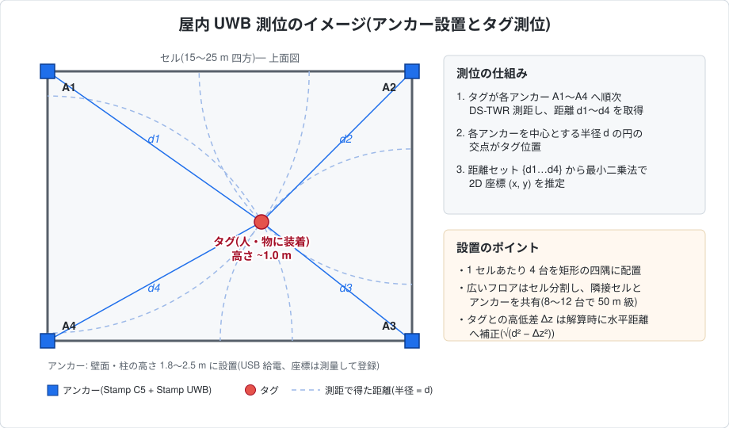
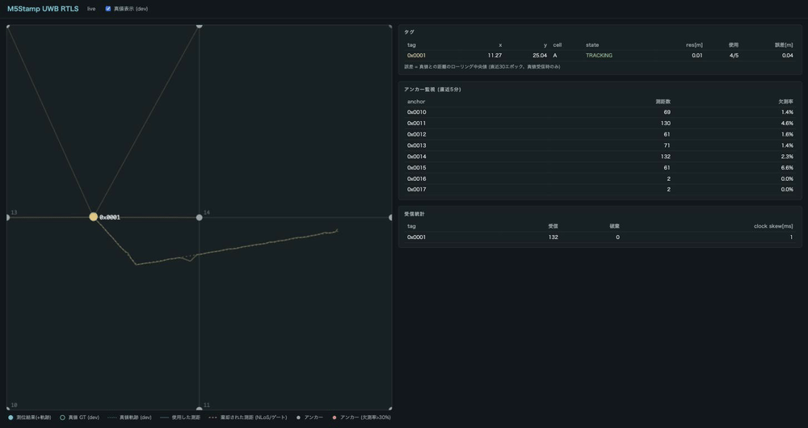

# M5Stamp UWB RTLS

[](https://github.com/atinfinity/m5stamp_uwb_rtls/actions/workflows/ci.yml)

M5Stack Stamp UWB (Qorvo QM33120W) + Stamp C5 による屋内 2D RTLS(リアルタイム測位システム)。

> [!CAUTION]
> 本プロジェクトは**実機での動作確認を未実施**です。データシート・公式ドキュメント・公式サンプルコードなどの公開情報をもとに実装しており、実機では動作しない・調整が必要となる可能性があります(ファームウェア、3D プリントモデルの寸法などを含む)。

> [!NOTE]
> 本プロジェクトは**非公式の個人プロジェクト**です。M5Stack 社・Qorvo 社およびその関連企業とは一切関係ありません。



*屋内にアンカーを設置してタグを測位するイメージ。壁面・柱(高さ 1.8〜2.5 m)の四隅にアンカーを設置し、タグが各アンカーへ順次 [DS-TWR](docs/ds-twr-design.md) 測距 → 得られた距離セットから最小二乗法で 2D 座標を推定する。配置設計の詳細は [docs/rtls-design.md](docs/rtls-design.md) §3.3 を参照。*



*可視化 UI の動作例(実機レス: 仮想タグ + シミュレータ)。**●** = 測位結果(実線 = 推定軌跡)、**○** = 真値 GT(点線 = 真値軌跡、開発モード)、細実線 = 解算に使用した測距、**赤破線** = 外れ値除去/ゲートで棄却された測距(NLoS)。右側は監視パネル(アンカー別欠測率・受信統計)。凡例は画面下部に常時表示される。*

- 設計書: [docs/rtls-design.md](docs/rtls-design.md)(基本設計)ほか [docs/](docs/) 配下
  - 測位サーバー(A案): [server-design.md](docs/server-design.md) / タグ上計算(B案): [tag-design.md](docs/tag-design.md)
  - 測距方式: [DS-TWR](docs/ds-twr-design.md)(採用)/ [SS-TWR](docs/ss-twr-design.md)(予備)/ [TDoA](docs/tdoa-design.md)(将来)
- ハードウェア: [docs/hardware.md](docs/hardware.md)(想定ハードウェアリスト・組み立て図)/ [hardware/cad/](hardware/cad/README.md)(アンカー取付具・タグ用ケースの 3D プリントモデル)
- ファームウェア: [firmware/](firmware/)(Step 1: DS-TWR 1対1計測 — Issue #1)
- 測位サーバー: [server/](server/)(実機レスで開発可能 — Issue #3)
- 開発ガイド: [環境構築](docs/development.md) / [構成カスタマイズ(アンカー・タグ)](docs/configuration.md) / [測位アルゴリズム開発](docs/algorithm-guide.md) / [アプリケーション開発](docs/application-guide.md)([examples/](examples/) にサンプルあり)

## クイックスタート(実機不要)

パッケージ管理は [uv](https://docs.astral.sh/uv/) を使用(`brew install uv`)。詳細な環境構築手順は **[docs/development.md](docs/development.md)** を参照。

```bash
uv sync --all-extras   # .venv 作成 + 依存インストール (dev グループ含む)

# テスト (解算・セル・e2e 回帰: シミュレータ→リプレイで CEP50 ≤ 0.30 m を検証)
uv run pytest

# 合成データ生成 → リプレイ
uv run python tools/simulate.py --config server/config.yaml --duration-s 120 \
    --out logs/sim_ranges.jsonl --truth logs/sim_truth.jsonl
uv run python -m server.replay logs/sim_ranges.jsonl --out logs/positions.jsonl
```

## ライブ実行(仮想タグで end-to-end)

```bash
mosquitto &                                          # MQTT ブローカー (brew install mosquitto)
uv run python -m server.app --config server/config.yaml   # 測位サーバー + Web UI
uv run python tools/virtual_tag.py                        # 仮想タグ 3 台 (別ターミナル)
```

ブラウザで http://localhost:8000 — フロアマップにタグ位置・軌跡・セルハンドオーバーがリアルタイム表示される。実機タグが用意できたら virtual_tag を実機に差し替えるだけで同じ経路が動く。

## 実機作業(要ハードウェア)

Step 1 の DS-TWR 実測手順は [firmware/README.md](firmware/README.md) を参照。実測値の反映先は Issue #1 のチェックリストにまとめてある。
