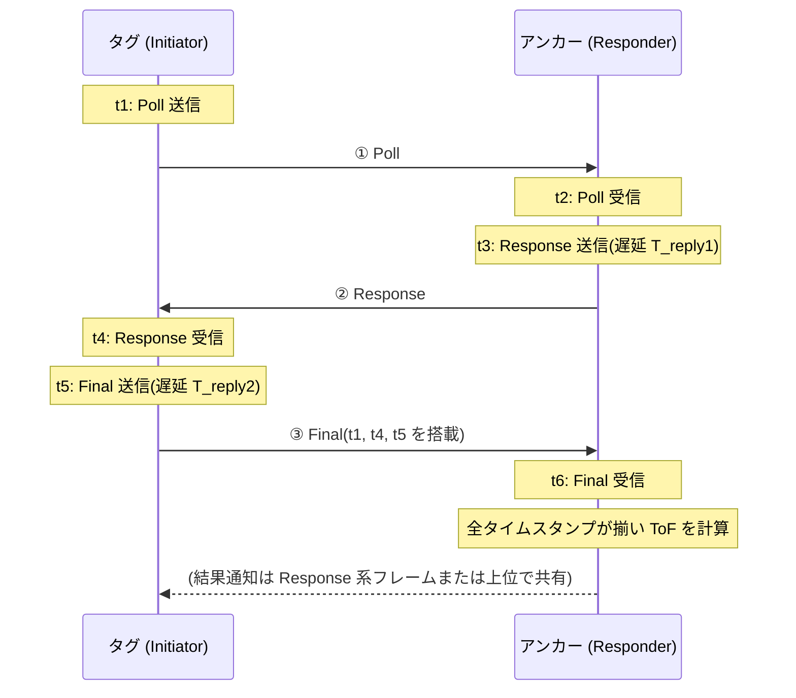

# DS-TWR 測距方式 詳細設計書

- 作成日: 2026-08-15
- ステータス: ドラフト(実装前レビュー用)
- 上位文書: [rtls-design.md](rtls-design.md) §2(**採用方式**)
- 関連文書: [ss-twr-design.md](ss-twr-design.md)(予備方式)、[tdoa-design.md](tdoa-design.md)(将来方式)

## 1. 位置づけ

DS-TWR(Double-Sided Two-Way Ranging)は本システムの**標準測距方式**。本書はその原理、公式ライブラリでの実装仕様、タイミング設計、誤差予算を定める。

## 2. 測距原理

### 2.1 メッセージ交換(3 メッセージ方式)



### 2.2 ToF 計算式

タグ側往復 `T_round1 = t4 − t1`、アンカー側応答遅延 `T_reply1 = t3 − t2`、アンカー側往復 `T_round2 = t6 − t3`、タグ側応答遅延 `T_reply2 = t5 − t4` として:

```
ToF = (T_round1 × T_round2 − T_reply1 × T_reply2)
      ─────────────────────────────────────────────
      (T_round1 + T_round2 + T_reply1 + T_reply2)

距離 d = c × ToF   (c = 299,792,458 m/s。1 ns ≈ 30 cm)
```

### 2.3 クロックドリフト誤差の相殺(DS-TWR を採用する理由)

タグ・アンカーの水晶に周波数偏差 e_T, e_A(各 ±20 ppm 程度)があっても、上式は**両側の往復を掛け合わせる対称形**のため、1 次のドリフト誤差が相殺される。残留誤差は近似的に

```
err ≈ ToF × (e_T + e_A) / 2      (例: ToF 100 ns × 40 ppm → 4 fs ≈ 1 µm)
```

と無視できる。SS-TWR のように応答遅延 T_reply にドリフトが乗らないため、**µs 級のホスト処理遅延があっても精度が保たれる**。これがホスト MCU(Arduino ループ)経由で制御する本構成に DS-TWR が適する本質的な理由である。

## 3. ライブラリ実装仕様

### 3.1 使用 API

| 役割 | API | 備考 |
|---|---|---|
| タグ | `requestDSRange(M5Stamp_UWBDSRangeConfig)` → `M5Stamp_UWBDSRangeResult` | ブロッキング呼出し。結果に距離 (mm/m)・シーケンス番号・成否 |
| アンカー | `respondDSRange(M5Stamp_UWBDSRangeConfig)` → `M5Stamp_UWBDSResponderResult` | ループで呼び続け、自局宛 Poll に応答 |

### 3.2 フレーム・アドレス設定

- PAN ID `0xDECA`、アドレス体系は基本設計 §4.2(アンカー `0x0010`〜、タグ `0x0001`〜)。
- タグは測距のたびに `DSRangeConfig` の相手アドレスを巡回リストの次のアンカーに差し替えて `requestDSRange()` を呼ぶ(基本設計 §4.4)。
- PHY 設定は既定(Channel 9、BPRF)。全ノードで統一し、変更時は全ノード一斉更新とする。

### 3.3 タイミングパラメータ(公式サンプル準拠 → Step 1 実測で確定)

| パラメータ | 初期値 | 説明 |
|---|---|---|
| `response_delay` (アンカー) | 3000 µs | Poll 受信 → Response 送信の遅延。ホスト SPI 往復を吸収できる下限を実測で探る(サンプルは 1500〜3000 µs) |
| `final_delay` (タグ) | 3000 µs | Response 受信 → Final 送信の遅延 |
| RX タイムアウト | 3000 µs | 各受信待ちの上限 |
| ホスト側ポーリングタイムアウト | 100 ms | `requestDSRange()` 全体の上限 |
| 1 交換の所要時間(見込み) | 5〜10 ms | ロードマップ Step 1 で実測し、TDMA スロット設計(基本設計 §4.4)を確定する |

**遅延パラメータの方針**: 短くするほどエアタイムは減るが、ホスト(Arduino ループ+SPI)の応答ジッタでタイムアウト率が上がる。Step 1 で「成功率 99% を保てる最小値」を求め、`rtls_common` の共有ヘッダに定数として固定する。

### 3.4 リトライとエラー処理

- 1 アンカーにつき失敗時リトライ 1 回(乱数バックオフ 1〜5 ms)。それでも失敗なら当該サイクルは欠測(基本設計 §4.4)。
- `lastError()` の種別(タイムアウト / CRC / チップ異常)をタグの統計に集計し、MQTT 統計(A案 §12)へ流す。チップ異常が連続する場合は `hardReset()` → `begin()` で復帰を試みる。

## 4. 誤差予算と対策

| 誤差要因 | 大きさ(目安) | 対策 |
|---|---|---|
| 測距ノイズ(LoS) | σ ≈ 5〜10 cm(仕様誤差 0.14 m) | カルマンフィルタで平滑化(server-design.md §5) |
| アンテナ遅延オフセット | 数十 cm(個体差) | ノード別 `bias_mm` 校正(基本設計 §6) |
| クロックドリフト | ~µm(§2.3 で相殺) | 対策不要 — DS-TWR の利点 |
| NLoS(遮蔽・マルチパス) | +0.3〜数 m(伸びる方向) | 残差ベース外れ値除去 + ゲーティング(server-design.md §5) |
| 温度による遅延変動 | 数 cm | 定期再校正(季節単位)で十分 |
| アンカー座標誤差 | 設置測量に依存 | ±3 cm 以内で測量(基本設計 §3.3) |

## 5. TDMA との統合

基本設計 §4.4 のスロット(90 ms)内で 4 アンカー × (1 交換 + リトライ) を実行する。本方式固有の考慮:

- **交換中の割込み耐性**: DS-TWR は 3 メッセージが揃って 1 測距。他タグの電波はアドレス不一致で無視されるが、交換中の衝突は Final 喪失として現れる。リトライで吸収し、スロット同期(±10 ms、基本設計 §4.9)で衝突自体を稀にする。
- **アンカー側は常時 `respondDSRange()` ループ**であり、どのタグの Poll にも(自局宛なら)応答する。アンカーにスロットの概念は不要 — タグ側の規律だけで TDMA が成立する。

## 6. テスト計画(ロードマップ Step 1 に対応)

1. **静的精度**: 既知距離 1 / 5 / 10 / 20 / 40 m(LoS)で各 1000 回測距。平均誤差(→ bias 校正値)と σ を記録。受入: 校正後 |平均誤差| ≤ 5 cm、σ ≤ 10 cm。
2. **タイミング実測**: 1 交換の所要時間分布(p50/p95/p99)と、`response_delay` を 3000 → 1500 µs へ詰めた際の成功率変化。TDMA スロット幅の根拠データとする。
3. **成功率 vs 距離**: 5 m 刻みで成功率を測り、実効レンジ(成功率 95% を保てる距離)を求める。セル寸法(15〜25 m)の妥当性を確認。
4. **干渉試験**: 2 タグが同時に同一アンカーへ Poll する最悪ケースを意図的に作り、失敗がタイムアウトとして安全に現れる(誤距離が出ない)ことを確認。
