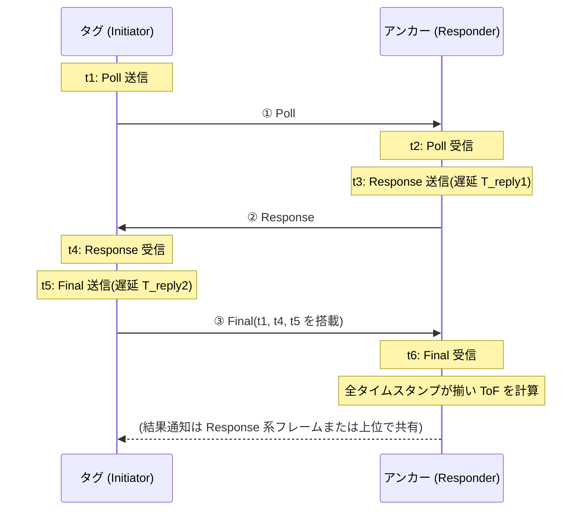

# DS-TWR測距方式詳細設計書

- 作成日: 2026-08-15
- ステータス: ドラフト(実装前レビュー用)
- 上位文書: [rtls-design.md](rtls-design.md) §2(**採用方式**)
- 関連文書: [ss-twr-design.md](ss-twr-design.md)(予備方式)、[tdoa-design.md](tdoa-design.md)(将来方式)

## 1. 位置づけ

DS-TWR(Double-Sided Two-Way Ranging)は本システムの**標準測距方式**。本書はその原理、公式ライブラリでの実装仕様、タイミング設計、誤差予算を定める。

## 2. 測距原理

### 2.1 メッセージ交換(3メッセージ方式)


```mermaid
sequenceDiagram
    participant T as タグ (Initiator)
    participant A as アンカー (Responder)
    Note over T: t1: Poll 送信
    T->>A: ① Poll
    Note over A: t2: Poll 受信
    Note over A: t3: Response 送信(遅延 T_reply1)
    A->>T: ② Response
    Note over T: t4: Response 受信
    Note over T: t5: Final 送信(遅延 T_reply2)
    T->>A: ③ Final(t1, t4, t5 を搭載)
    Note over A: t6: Final 受信
    Note over A: 全タイムスタンプが揃い ToF を計算
    A-->>T: (結果通知は Response 系フレームまたは上位で共有)
```

### 2.2 ToF計算式

タグ側往復`T_round1 = t4 − t1`、アンカー側応答遅延`T_reply1 = t3 − t2`、アンカー側往復`T_round2 = t6 − t3`、タグ側応答遅延`T_reply2 = t5 − t4`として:

```
ToF = (T_round1 × T_round2 − T_reply1 × T_reply2)
      ─────────────────────────────────────────────
      (T_round1 + T_round2 + T_reply1 + T_reply2)

距離 d = c × ToF   (c = 299,792,458 m/s。1 ns ≈ 30 cm)
```

### 2.3 クロックドリフト誤差の相殺(DS-TWRを採用する理由)

タグ・アンカーの水晶に周波数偏差e_T, e_A(各 ±20 ppm程度)があっても、上式は**両側の往復を掛け合わせる対称形**のため、1次のドリフト誤差が相殺される。残留誤差は近似的に

```
err ≈ ToF × (e_T + e_A) / 2      (例: ToF 100 ns × 40 ppm / 2 = 2 ps → 距離換算 ≈ 0.6 mm)
```

と無視できる。SS-TWRと違って応答遅延T_replyにドリフトが乗らないため、**µs級のホスト処理遅延があっても精度が保たれる**。これがホストMCU(Arduinoループ)経由で制御する本構成にDS-TWRが適する本質的な理由である。

## 3. ライブラリ実装仕様

### 3.1 使用API

| 役割 | API | 備考 |
|---|---|---|
| タグ | `requestDSRange(M5Stamp_UWBDSRangeConfig)` → `M5Stamp_UWBDSRangeResult` | ブロッキング呼出し。結果に距離(mm/m)・シーケンス番号・成否 |
| アンカー | `respondDSRange(M5Stamp_UWBDSRangeConfig)` → `M5Stamp_UWBDSResponderResult` | ループで呼び続け、自局宛Pollに応答 |

### 3.2 フレーム・アドレス設定

- PAN ID `0xDECA`、アドレス体系は基本設計 §4.2(アンカー`0x0010`〜、タグ`0x0001`〜)。
- タグは測距のたびに`DSRangeConfig`の相手アドレスを巡回リストの次のアンカーに差し替えて`requestDSRange()`を呼ぶ(基本設計 §4.4)。
- PHY設定は既定(Channel 9、BPRF)。全ノードで統一し、変更時は全ノード一斉更新とする。

### 3.3 タイミングパラメータ(公式サンプル準拠 → Step 1実測で確定)

| パラメータ(ライブラリ設定名 / 本プロジェクトの定数名) | 初期値 | 説明 |
|---|---|---|
| `responseTxDelayUus` / `kDsResponseTxDelayUus`(アンカー) | 3000 µs | Poll受信 → Response送信の遅延。ホストSPI往復を吸収できる下限を実測で探る(サンプルは1500〜3000 µs) |
| `finalTxDelayUus` / `kDsFinalTxDelayUus`(タグ) | 1800 µs | Response受信 → Final送信の遅延 |
| `rxTimeoutUus` / `kDsRxTimeoutUus` | 3000 µs | 各受信待ちの上限 |
| `hostTimeoutMs` / `kDsHostTimeoutMs` | 100 ms | `requestDSRange()`全体の上限 |
| `resultRepeatCount` / `kDsResultRepeatCount`(アンカー) | 1 回 | アンカー→タグのResultフレーム再送回数。ライブラリ既定は3だが、タグは最初のResultで次アンカーのPollへ移るため余分な再送は次の交換と衝突する。公式`DS_TWR_MULTI_ANCHOR`例に合わせて1 |
| `resultRepeatGapMs` / `kDsResultRepeatGapMs` | 3 ms | Result再送間隔(再送1回では未使用) |
| — / `kDsInterAnchorGapMs`(タグ) | 2 ms | 巡回中のアンカー切替ギャップ。前アンカーがTX→RXに戻る猶予(公式例は20 ms。4台 × 20 msではスロット予算を超えるため、Step 1で最小値を実測) |
| 1交換の所要時間(見込み) | 5〜10 ms | ロードマップStep 1で実測し、TDMAスロット設計(基本設計 §4.4)を確定する |

現在の確定値は`firmware/lib/rtls_common/rtls_common.h`の`kDs*`定数を正とする(この定数がライブラリ設定の各フィールドへ代入される)。

**遅延パラメータの方針**: 短くするほどエアタイムは減るが、ホスト(Arduinoループ+SPI)の応答ジッタでタイムアウト率が上がる。Step 1で「成功率99% を保てる最小値」を求め、`rtls_common`の共有ヘッダに定数として固定する。

### 3.4 リトライとエラー処理

- 1アンカーにつき失敗時リトライ1回(乱数バックオフ1〜5 ms)。それでも失敗なら当該サイクルは欠測(基本設計 §4.4)。
- アンカー側の`RangeFrameMismatch`は「他アンカー宛のPollを受信した」事象で、多アンカー環境では毎サイクル発生する正常動作。統計では`ignored`として`err`と区別する(公式`DS_TWR_MULTI_ANCHOR`例と同じ扱い)。
- `lastError()`の種別(タイムアウト / CRC / チップ異常)をタグの統計に集計し、MQTT統計(A案 §12)へ流す。チップ異常が連続する場合は`hardReset()` → `begin()`で復帰を試みる。

## 4. 誤差予算と対策

| 誤差要因 | 大きさ(目安) | 対策 |
|---|---|---|
| 測距ノイズ(LoS) | σ ≈ 5〜10 cm(仕様誤差0.14 m) | カルマンフィルタで平滑化(server-design.md §5) |
| アンテナ遅延オフセット | 数十cm(個体差) | ノード別`bias_mm`校正(基本設計 §6) |
| クロックドリフト | < 1 mm(§2.3で相殺) | 対策不要 — DS-TWRの利点 |
| NLoS(遮蔽・マルチパス) | +0.3〜数m(伸びる方向) | 残差ベース外れ値除去 + ゲーティング(server-design.md §5) |
| 温度による遅延変動 | 数cm | 定期再校正(季節単位)で十分 |
| アンカー座標誤差 | 設置測量に依存 | ±3 cm以内で測量(基本設計 §3.3) |

## 5. TDMAとの統合

基本設計 §4.4のスロット(90 ms)内で4アンカー × (1交換 + リトライ)を実行する。本方式固有の考慮:

- **交換中の割込み耐性**: DS-TWRは3メッセージが揃って1測距。他タグの電波はアドレス不一致で無視されるが、交換中の衝突はFinal喪失として現れる。リトライで吸収し、スロット同期(±10 ms、基本設計 §4.9)で衝突自体を稀にする。
- **アンカー側は常時`respondDSRange()`ループ**であり、どのタグのPollにも(自局宛なら)応答する。アンカーにスロットの概念は不要 — タグ側の規律だけでTDMAが成立する。

## 6. テスト計画(ロードマップStep 1に対応)

1. **静的精度**: 既知距離1 / 5 / 10 / 20 / 40 m(LoS)で各1000回測距。平均誤差(→ bias校正値)と σ を記録。受入: 校正後 |平均誤差| ≤ 5 cm、σ ≤ 10 cm。
2. **タイミング実測**: 1交換の所要時間分布(p50/p95/p99)と、`response_delay`を3000 → 1500 µsへ詰めた際の成功率変化。TDMAスロット幅の根拠データとする。
3. **成功率vs距離**: 5 m刻みで成功率を測り、実効レンジ(成功率95% を保てる距離)を求める。セル寸法(15〜25 m)の妥当性を確認。
4. **干渉試験**: 2タグが同時に同一アンカーへPollする最悪ケースを意図的に作り、失敗がタイムアウトとして安全に現れる(誤距離が出ない)ことを確認。
