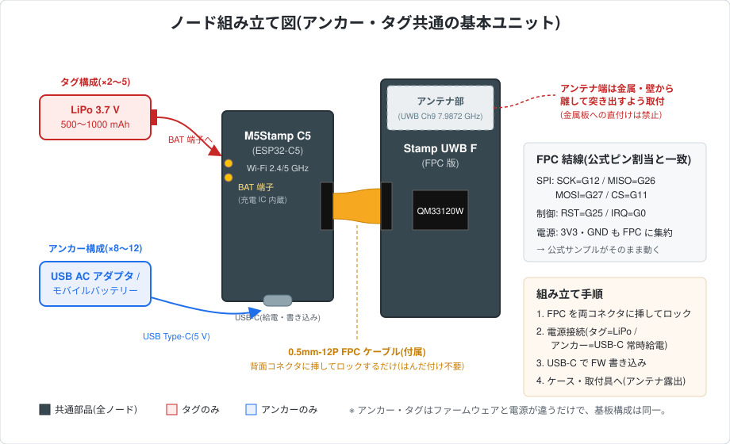

# ハードウェアガイド(想定ハードウェアリスト・組み立て)

本システムで想定しているハードウェアの一覧と、ノード(アンカー・タグ)の組み立て方をまとめる。設計上の根拠(選定理由・BOM 概算・配置設計)は基本設計 [rtls-design.md](rtls-design.md) §3 を参照。

## 1. 想定ハードウェアリスト

アンカー・タグはどちらも **M5Stamp C5 + M5Stamp UWB F** の同一ユニットで、ファームウェアと電源だけが異なる。

| 品目 | 用途 | 数量 | 備考 |
|---|---|---|---|
| M5Stamp C5(ESP32-C5) | アンカー・タグ共通のメイン MCU | 13〜17 | Wi-Fi 6(2.4/5 GHz)対応。SGM40567 充電 IC・電池端子内蔵 |
| M5Stamp UWB F(Qorvo QM33120W、FPC 版) | UWB 測距モジュール | 13〜17 | 0.5mm-12P FPC ケーブル付属。無印版(キャスタレーション実装)は量産フェーズ向けで、プロトタイプは FPC 版を推奨 |
| LiPo バッテリー 3.7 V 500〜1000 mAh | タグ電源 | 2〜5 | Stamp C5 の BAT 端子に接続(充電 IC 内蔵) |
| USB AC アダプタ + USB-C ケーブル | アンカー給電 | 8〜12 | 常時給電(モバイルバッテリーでも可) |
| タグ用ケース・アンカー取付具 | 筐体・設置 | 一式 | 3D プリント等。アンテナ部を遮らない形状にする |
| PC(常設なら Raspberry Pi も可) | 測位サーバー(Mosquitto + Python 解算/可視化) | 1 | |
| Wi-Fi AP(2.4/5 GHz) | タグ→サーバーのテレメトリ経路 | 1 | 既設流用可。アンカーは Wi-Fi 不要 |
| レーザー距離計 | アンカー座標の測量・校正 | 1 | 推奨(±3 cm 以内で座標登録するため) |

数量の内訳: アンカー 8〜12 台 + タグ 2〜5 台。予備を 1〜2 セット追加推奨。価格概算(合計 約 $540〜660)は [rtls-design.md](rtls-design.md) §3.2(BOM)を参照。

## 2. ノード組み立て図

Stamp C5 と Stamp UWB F は、UWB F 付属の **0.5mm-12P FPC ケーブル 1 本**で直結する。FPC に SPI 5 線+制御 2 線+電源がまとまっており、Stamp C5 背面 FPC コネクタのピン割当が公式サンプルの想定(SCK=G12, MISO=G26, MOSI=G27, CS=G11, RST=G25, IRQ=G0)と一致しているため、**はんだ付け・配線作業は不要**。

## 3. 組み立て手順

1. **FPC 接続**: Stamp C5 背面と Stamp UWB F の FPC コネクタに付属ケーブルを挿し、コネクタのロックを閉じる。
2. **電源接続**:
   - タグ: LiPo バッテリーを Stamp C5 の BAT 端子へ接続(充電は USB-C 経由)。
   - アンカー: USB AC アダプタまたはモバイルバッテリーから USB Type-C で常時給電。
3. **ファームウェア書き込み**: USB-C で PC に接続し、[firmware/](../firmware/) の手順で anchor / tag を書き込む。
4. **筐体・設置**: ケース・取付具に収める。以下のアンテナ取り扱いに注意する。

### アンテナ取り扱いの注意(重要)

- **アンテナ端が金属・壁から離れるよう突き出して取り付ける。金属板への直付けは禁止**(公式ドキュメントの要求)。
- 机上での実験時も、アンテナ端が金属・机面に近づかないよう治具等で浮かせる([firmware/README.md](../firmware/README.md) Step 1 参照)。
- アンカーの設置高さ・配置(高さ 1.8〜2.5 m、セル四隅、座標測量)は [rtls-design.md](rtls-design.md) §3.3 を参照。
