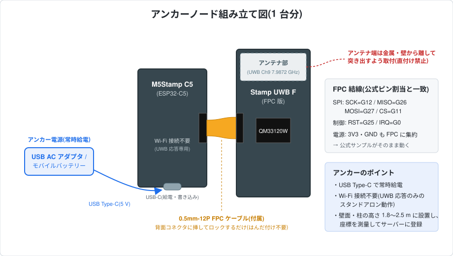
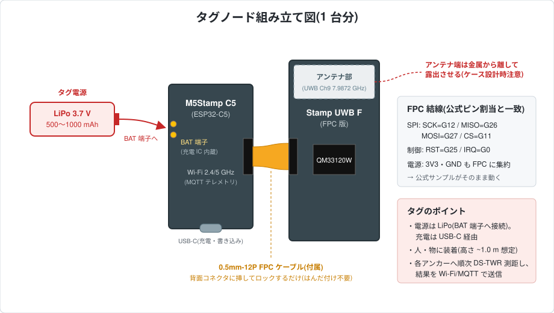

# ハードウェアガイド(想定ハードウェアリスト・組み立て)

本システムで想定しているハードウェアの一覧と、ノード(アンカー・タグ)の組み立て方をまとめる。設計上の根拠(選定理由・BOM 概算・配置設計)は基本設計 [rtls-design.md](rtls-design.md) §3 を参照。

数量は**タグ 1 台 + アンカー 1 台**の最小構成(DS-TWR 1 対 1 測距 = [firmware/README.md](../firmware/README.md) Step 1 相当)で記載する。2D 測位には 1 セルあたりアンカー 4 台が標準(解算だけなら 3 台が下限)で、実運用の数量(アンカー 8〜12 + タグ 2〜5)と価格概算は [rtls-design.md](rtls-design.md) §3.1〜3.3 を参照。

## 1. 想定ハードウェアリスト

アンカー・タグはどちらも **M5Stamp C5 + M5Stamp UWB F** の同一ユニットで、ファームウェアと電源だけが異なる。

### 1.1 アンカー用(1 台分)

| 品目 | 用途 | 数量 | 備考 |
|---|---|---|---|
| [M5Stamp C5](https://shop.m5stack.com/products/m5stampc5-module-esp32-c5)(ESP32-C5) | メイン MCU | 1 | アンカーは Wi-Fi 接続不要(UWB 応答専用) |
| [M5Stamp UWB F](https://shop.m5stack.com/products/m5stamp-uwb-module-with-fpc-qm33120w)(Qorvo QM33120W、FPC 版) | UWB 測距モジュール | 1 | 0.5mm-12P FPC ケーブル付属。[無印版](https://shop.m5stack.com/products/m5stamp-uwb-module-qm33120w)(キャスタレーション実装)は量産フェーズ向けで、プロトタイプは FPC 版を推奨 |
| USB AC アダプタ + USB-C ケーブル | 常時給電 | 1 | モバイルバッテリーでも可 |
| アンカー取付具 | 壁面・柱への設置 | 1 | 3D プリント(モデルは [hardware/cad/](../hardware/cad/)、§4 参照)。アンテナ部を遮らない形状 |

### 1.2 タグ用(1 台分)

| 品目 | 用途 | 数量 | 備考 |
|---|---|---|---|
| [M5Stamp C5](https://shop.m5stack.com/products/m5stampc5-module-esp32-c5)(ESP32-C5) | メイン MCU + Wi-Fi テレメトリ | 1 | Wi-Fi 6(2.4/5 GHz)対応。SGM40567 充電 IC・電池端子内蔵 |
| [M5Stamp UWB F](https://shop.m5stack.com/products/m5stamp-uwb-module-with-fpc-qm33120w)(Qorvo QM33120W、FPC 版) | UWB 測距モジュール | 1 | 同上(FPC ケーブル付属) |
| LiPo バッテリー 3.7 V 500〜1000 mAh | 電源 | 1 | Stamp C5 の BAT 端子に接続。充電は USB-C 経由 |
| タグ用ケース | 装着用筐体 | 1 | 3D プリント(モデルは [hardware/cad/](../hardware/cad/)、§4 参照)。アンテナ部を遮らない形状 |

### 1.3 共通(システム全体で)

| 品目 | 用途 | 数量 | 備考 |
|---|---|---|---|
| PC(常設なら Raspberry Pi も可) | 測位サーバー(Mosquitto + Python 解算/可視化) | 1 | |
| Wi-Fi AP(2.4/5 GHz) | タグ→サーバーのテレメトリ経路 | 1 | 既設流用可。アンカーは Wi-Fi 不要 |
| レーザー距離計 | アンカー座標の測量・校正 | 1 | 推奨(±3 cm 以内で座標登録するため) |

## 2. 組み立て図

Stamp C5 と Stamp UWB F は、UWB F 付属の **0.5mm-12P FPC ケーブル 1 本**で直結する。FPC に SPI 5 線+制御 2 線+電源がまとまっており、Stamp C5 背面 FPC コネクタのピン割当が公式サンプルの想定(SCK=G12, MISO=G26, MOSI=G27, CS=G11, RST=G25, IRQ=G0, WAKEUP=G24, GP7=G23)と一致しているため、**はんだ付け・配線作業は不要**。

### 2.1 アンカーノード

### 2.2 タグノード

## 3. 組み立て手順

1. **FPC 接続**: Stamp C5 背面と Stamp UWB F の FPC コネクタに付属ケーブルを挿し、コネクタのロックを閉じる(アンカー・タグ共通)。
2. **電源接続**:
   - アンカー: USB AC アダプタまたはモバイルバッテリーから USB Type-C で常時給電。
   - タグ: LiPo バッテリーを Stamp C5 の BAT 端子へ接続(充電は USB-C 経由)。
3. **ファームウェア書き込み**: USB-C で PC に接続し、[firmware/](../firmware/) の手順で anchor / tag を書き込む。
4. **筐体・設置**: ケース・取付具(§4 の 3D プリントモデル)に収める。以下のアンテナ取り扱いに注意する。

### アンテナ取り扱いの注意(重要)

- **アンテナ端が金属・壁から離れるよう突き出して取り付ける。金属板への直付けは禁止**(公式ドキュメントの要求)。
- 机上での実験時も、アンテナ端が金属・机面に近づかないよう治具等で浮かせる([firmware/README.md](../firmware/README.md) Step 1 参照)。
- アンカーの設置高さ・配置(高さ 1.8〜2.5 m、セル四隅、座標測量)は [rtls-design.md](rtls-design.md) §3.3 を参照。

## 4. 3D プリントモデル(アンカー取付具・タグ用ケース)

OpenSCAD ソースと STL を **[hardware/cad/](../hardware/cad/)** に置いている(パラメータ調整・再生成の方法は同ディレクトリの [README](../hardware/cad/README.md) を参照)。公称寸法ベースの v1 モデルのため、印刷後に実機でフィット確認し `tol` 等を調整すること。

### 4.1 アンカー取付具

壁面・柱用の L ブラケット([anchor_mount.scad](../hardware/cad/anchor_mount.scad) / [STL](../hardware/cad/stl/anchor_mount.stl))。皿ネジ M3×3 本で固定し、前面ポケットに C5、上部棚に UWB F を置く。UWB F のアンテナ端は棚の前縁(壁と反対側)を向き、「金属・壁から離して突き出す」要求(§3 アンテナ注意・[rtls-design.md](rtls-design.md) §3.3)を満たす。FPC はプレート前面の溝と棚のスリットを通す。

### 4.2 タグ用ケース

本体 + 摩擦嵌合フタの 2 部品([tag_case.scad](../hardware/cad/tag_case.scad) / STL: [本体](../hardware/cad/stl/tag_case_body.stl)・[フタ](../hardware/cad/stl/tag_case_lid.stl))。内部は LiPo | C5 | UWB F の 3 室で、アンテナ端はケース端とフタの開口(アンテナ窓)により樹脂で覆われない。USB-C は側壁スロットから充電・書き込み可能で、バッテリー端にストラップループ付き。LiPo 寸法は `bat` パラメータで変更できる。
