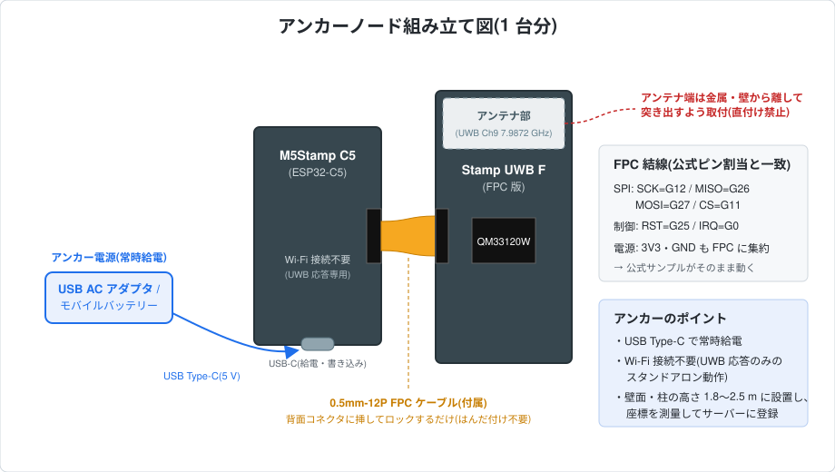
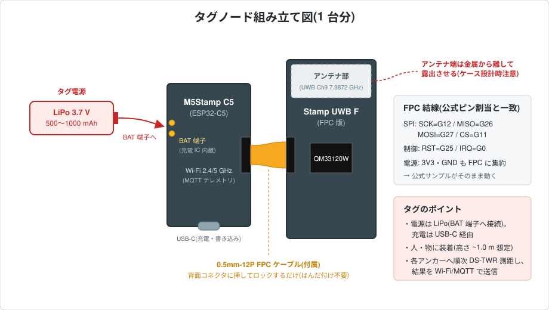
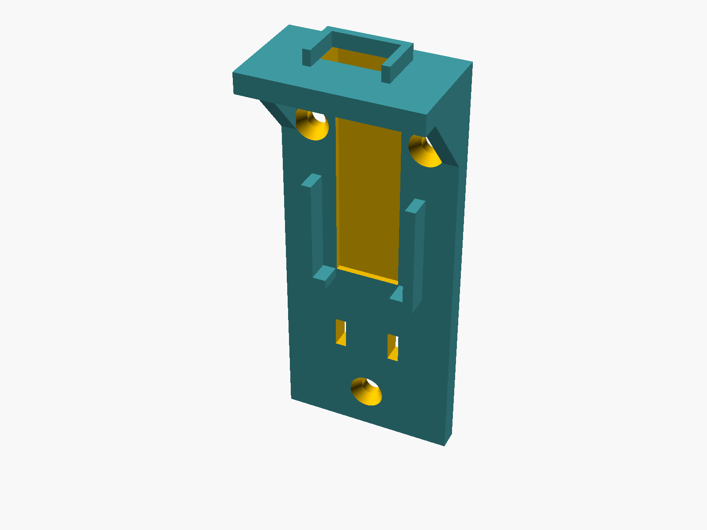
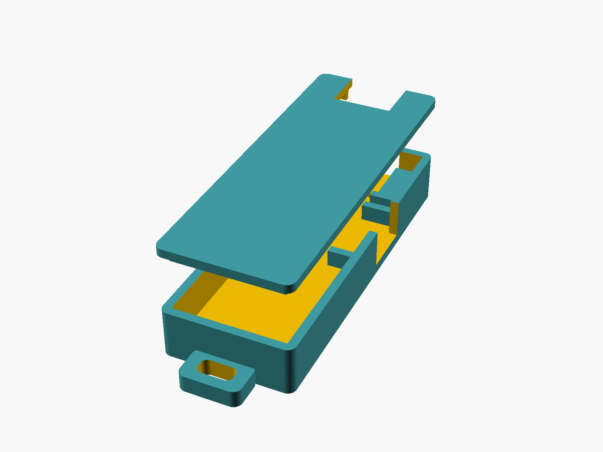

# ハードウェアガイド(想定ハードウェアリスト・組み立て)

本システムで想定しているハードウェアの一覧と、ノード(アンカー・タグ)の組み立て方をまとめる。設計上の根拠(選定理由・BOM概算・配置設計)は基本設計[rtls-design.md](rtls-design.md) §3を参照。

数量は**タグ1台 + アンカー1台**の最小構成(DS-TWR 1対1測距 = [firmware/README.md](../firmware/README.md) Step 1相当)で記載する。2D測位では1セルあたりアンカー4台が標準(解算だけなら3台が下限)。実運用の数量(アンカー8〜12 + タグ2〜5)と価格概算は[rtls-design.md](rtls-design.md) §3.1〜3.3を参照。

## 1. 想定ハードウェアリスト

アンカー・タグはどちらも**M5Stamp C5 + M5Stamp UWB F**の同一ユニットで、ファームウェアと電源だけが異なる。

### 1.1 アンカー用(1台分)

| 品目 | 用途 | 数量 | 備考 |
|---|---|---|---|
| [M5Stamp C5](https://shop.m5stack.com/products/m5stampc5-module-esp32-c5)(ESP32-C5) | メインMCU | 1 | アンカーはWi-Fi接続不要(UWB応答専用) |
| [M5Stamp UWB F](https://shop.m5stack.com/products/m5stamp-uwb-module-with-fpc-qm33120w)(Qorvo QM33120W、FPC版) | UWB測距モジュール | 1 | 0.5mm-12P FPCケーブル付属。[無印版](https://shop.m5stack.com/products/m5stamp-uwb-module-qm33120w)(キャスタレーション実装)は量産フェーズ向けで、プロトタイプはFPC版を推奨 |
| USB ACアダプタ + USB-Cケーブル | 常時給電 | 1 | モバイルバッテリーでも可 |
| アンカー取付具 | 壁面・柱への設置 | 1 | 3Dプリント(モデルは[hardware/cad/](../hardware/cad/)、§4参照)。アンテナ部を遮らない形状 |

### 1.2 タグ用(1台分)

| 品目 | 用途 | 数量 | 備考 |
|---|---|---|---|
| [M5Stamp C5](https://shop.m5stack.com/products/m5stampc5-module-esp32-c5)(ESP32-C5) | メインMCU + Wi-Fiテレメトリ | 1 | Wi-Fi 6(2.4/5 GHz)対応。SGM40567充電IC・電池端子内蔵 |
| [M5Stamp UWB F](https://shop.m5stack.com/products/m5stamp-uwb-module-with-fpc-qm33120w)(Qorvo QM33120W、FPC版) | UWB測距モジュール | 1 | 同上(FPCケーブル付属) |
| LiPoバッテリー3.7 V 400〜1000 mAh | 電源 | 1 | Stamp C5のVBAT/GNDパッドにはんだ付け。充電はUSB-C経由 |
| タグ用ケース | 装着用筐体 | 1 | 3Dプリント(モデルは[hardware/cad/](../hardware/cad/)、§4参照)。アンテナ部を遮らない形状 |

### 1.3 共通(システム全体で)

| 品目 | 用途 | 数量 | 備考 |
|---|---|---|---|
| PC(常設ならRaspberry Piも可) | 測位サーバー(Mosquitto + Python解算/可視化) | 1 | |
| Wi-Fi AP(2.4/5 GHz) | タグ→サーバーのテレメトリ経路 | 1 | 既設流用可。アンカーはWi-Fi不要 |
| レーザー距離計 | アンカー座標の測量・校正 | 1 | 推奨(±3 cm以内で座標登録するため) |

### 1.4 購入時の注意

- **国内での入手先**: スイッチサイエンスで[M5Stamp UWBモジュール(FPCコネクタ、FPCケーブル付き)M5STACK-S017-F](https://www.switch-science.com/products/11375)と[M5StampC5 DIP M5STACK-S016-DIP](https://www.switch-science.com/products/11352)が扱われており、本ドキュメントの想定構成と一致する。アンカー・タグとも同一ユニットなので、両方をノード台数分そろえる。
- **Stamp C5「DIP」版のピンヘッダ**: DIP版には2.54mm-7Pピンヘッダ2本が付属するが、UWB FとはFPCで直結するため**はんだ付けは不要**。§4の3Dプリントモデルはヘッダなしの公称寸法で作っているので、ヘッダを付けるとケース・取付具に収まらない可能性がある。
- **Wi-Fi用外付けアンテナ**: Stamp C5のWi-Fiは付属アンテナ(FPCアンテナ、2.4/5 GHz、IPEX-1、14.3×5.3 mm、ケーブル長50 mm。[公式ドキュメント](https://docs.m5stack.com/en/core/Stamp-C5)参照)をIPEX-1コネクタにつないで使う。Stamp C5に同梱されているので別途購入は不要。タグはWi-Fiテレメトリに必須(アンカーはWi-Fi不要)。タグ用ケースではフタ裏の凹みに貼る(§4.2)。
- **LiPoバッテリーは別途必要**(タグのみ)。Stamp C5の充電電流は約200 mAなので、1C充電で200 mA以上を受け入れられる容量(目安400 mAh以上)を選ぶ。候補例(いずれもJST PH 2ピン、保護回路付き。2026年10月時点で品切れのため購入時に在庫を確認):
  - [リチウムイオンポリマー電池 400mAh](https://www.switch-science.com/products/3118)(DPTL-DTP502535、37×25.5×5.2 mm、約13 g)
  - [リチウムイオン電池 900mAh](https://www.switch-science.com/catalog/2073/)(54×36×6.2 mm、約24 g。充電電流0.5C=450 mA以下の指定も満たす)

  Stamp C5にバッテリー用コネクタはなく、2.54 mmピッチのパッド列の**VBAT(+)とGND(−)**に配線する([公式ピン配置図](https://docs.m5stack.com/en/core/Stamp-C5_DIP)。部品面を上・USB-Cを手前にして左列の上から3V3 / G1 / G2 / G3 / **VBAT** / USB_5V / **GND**)。JST PHコネクタ付きの電池をそのまま使うなら、[JST PH 2ピン付きワイヤ](https://switch-science.com/catalog/2215)をパッドにはんだ付けして中継する。電池側の極性(赤=+)も挿す前に確認すること。§4のタグ用ケースはLiPo寸法を`bat`パラメータで変更できる。

## 2. 組み立て図

Stamp C5とStamp UWB Fは、UWB F付属の**0.5mm-12P FPCケーブル1本**で直結する。FPCにSPI 5線+制御2線+電源がまとまっており、Stamp C5背面FPCコネクタのピン割当が公式サンプルの想定(SCK=G12, MISO=G26, MOSI=G27, CS=G11, RST=G25, IRQ=G0, WAKEUP=G24, GP7=G23)と一致しているため、**はんだ付け・配線作業は不要**。

### 2.1 アンカーノード

### 2.2 タグノード

## 3. 組み立て手順

1. **FPC接続**: Stamp C5背面とStamp UWB FのFPCコネクタに付属ケーブルを挿し、コネクタのロックを閉じる(アンカー・タグ共通)。**ケーブルの向きを誤るとモジュールを破損するおそれがある**(製品ページの注意事項)ため、公式の接続図で向きを確認してから挿す。なお、UWB FのFPCピン配置はStamp-S3/S3Aとは互換性がない(Stamp C5とは一致する)。
2. **Wi-Fiアンテナ接続**(タグ): Stamp C5のIPEX-1コネクタに付属アンテナを接続する。
3. **電源接続**:
   - アンカー: USB ACアダプタまたはモバイルバッテリーからUSB Type-Cで常時給電。
   - タグ: LiPoバッテリーをStamp C5のVBAT/GNDパッドへ接続(§1.4。充電はUSB-C経由)。開発初期はUSB給電でよい(下記「開発初期の給電」参照)。
4. **ファームウェア書き込み**: USB-CでPCに接続し、[firmware/](../firmware/)の手順でanchor / tagを書き込む。
5. **筐体・設置**: ケース・取付具(§4の3Dプリントモデル)に収める。以下のアンテナ取り扱いに注意する。

### 開発初期の給電

ケースに組み込む前の開発初期は、アンカー・タグともUSB Type-Cから給電すればよい。LiPoのはんだ付けはケースへの組み込み時([#49](https://github.com/atinfinity/m5stamp_uwb_rtls/issues/49))まで後回しにできる。

- **PCのUSB**: 給電とシリアルログ取得を兼ねられる。[firmware/README.md](../firmware/README.md) Step 1のDS-TWR 1対1測距では、ログを取る側をPCにつなぐ。
- **モバイルバッテリー**: PCから離して置くノード(アンカーや、距離を変えながら測るタグ)に使う。
  - **低電流での自動電源オフに注意**。多くの製品は出力がおおむね50〜100 mA以下になると数十秒〜数分で給電を止める。UWB Fの消費電流は公式値で受信側(アンカー)約58 mA、発信側(タグ)約5 mA(C5側は未確認)のため、省電力設定次第では自動オフの条件に入りうる。「低電流モード」「IoTモード」付きの製品を選ぶか、アンカーのように据え置くノードはUSB ACアダプタにする。測距が途中で止まったら、まず給電断を疑う。
- **電源ノイズ**: UWB Fは公式に「高PSRRのLDO、またはリップル12 mVpp以内の電源」を求めている。USBの5VはC5上で3.3Vに変換してからUWB Fに供給されるが、その変換回路の特性は未確認。測距値のばらつきが大きいときは、USB ACアダプタやPCのUSBに替えて比べ、電源が原因かを切り分ける。
- LiPoを取り付けた後は、USBとLiPoを同時につないでよい(C5の充電IC SGM40567がUSB接続時にLiPoを充電する)。

### アンテナ取り扱いの注意(重要)

- **アンテナ端が金属・壁から離れるよう突き出して取り付ける。金属板への直付けは禁止**(公式ドキュメントの要求)。
- 机上での実験時も、アンテナ端が金属・机面に近づかないよう治具等で浮かせる([firmware/README.md](../firmware/README.md) Step 1参照)。
- アンカーの設置高さ・配置(高さ1.8〜2.5 m、セル四隅、座標測量)は[rtls-design.md](rtls-design.md) §3.3を参照。

## 4. 3Dプリントモデル(アンカー取付具・タグ用ケース)

OpenSCADソースとSTLを **[hardware/cad/](../hardware/cad/)** に置いている(パラメータ調整・再生成の方法は同ディレクトリの[README](../hardware/cad/README.md)を参照)。公称寸法ベースのv1モデルのため、印刷後に実機でフィット確認し`tol`等を調整すること。

### 4.1 アンカー取付具

壁面・柱用のLブラケット([anchor_mount.scad](../hardware/cad/anchor_mount.scad) / [STL](../hardware/cad/stl/anchor_mount.stl))。皿ネジM3×3本で固定し、前面ポケットにC5、上部棚にUWB Fを置く。UWB Fのアンテナ端は棚の前縁(壁と反対側)を向き、「金属・壁から離して突き出す」要求(§3アンテナ注意・[rtls-design.md](rtls-design.md) §3.3)を満たす。FPCはプレート前面の溝と棚のスリットを通す。

### 4.2 タグ用ケース

本体 + 摩擦嵌合フタの2部品([tag_case.scad](../hardware/cad/tag_case.scad) / STL: [本体](../hardware/cad/stl/tag_case_body.stl)・[フタ](../hardware/cad/stl/tag_case_lid.stl))。内部はLiPo | C5 | FPC折り返し部 | UWB Fの順で、アンテナ端はケース端とフタの開口(アンテナ窓)により樹脂で覆われない。FPCケーブルはC5の上を渡して折り返し部で床に下ろす(経路の詳細は[hardware/cad/README.md](../hardware/cad/README.md))。USB-Cは側壁スロットから充電・書き込み可能で、バッテリー端にストラップループ付き。C5のWi-Fi用FPCアンテナはフタ裏の凹み(C5の上、+x寄り)に貼る。LiPo寸法は`bat`パラメータで変更できる(既定は§1.4の400 mAh品)。
