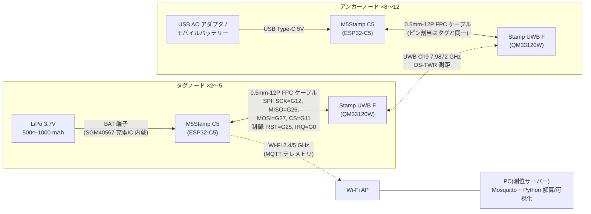
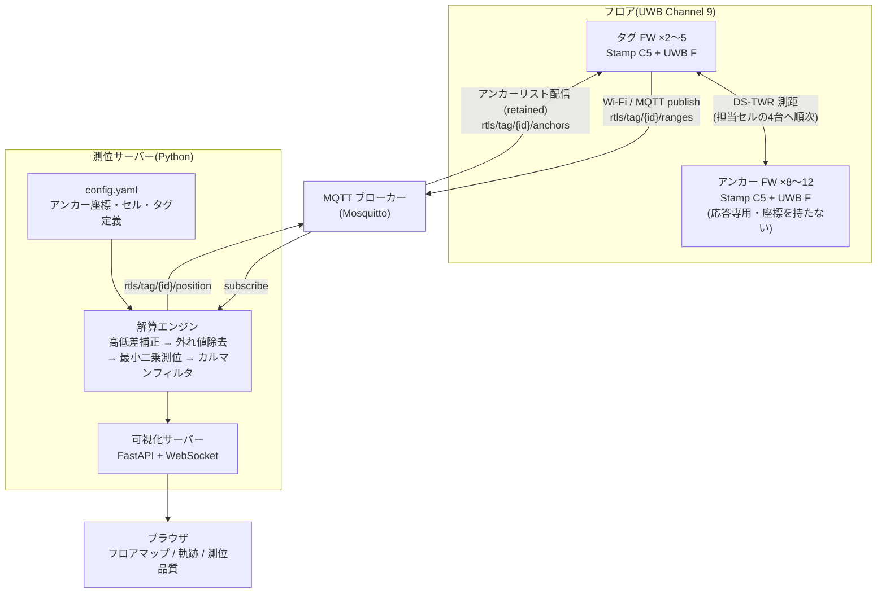

# M5Stamp UWB 屋内RTLS測位システム 設計書

- 作成日: 2026-08-15
- ステータス: ドラフト(実装前レビュー用)

## 1. システム概要

M5Stack Stamp UWB(Qorvo QM33120W 搭載)を用いて、屋内フロア(20〜50 m 規模)で移動タグの 2D 位置をリアルタイムに推定する RTLS(Real-Time Locating System)を構築する。

### 要件

| 項目 | 目標値 |
|---|---|
| 測位エリア | 屋内 20〜50 m 四方(単一フロア、2D) |
| タグ数 | 2〜5 台(同時測位) |
| 測位精度 | 実用 30 cm 程度(見通し時。DS-TWR の測距誤差は約 0.14 m) |
| 更新レート | タグあたり 1〜2 Hz(初期目標。チューニングで向上余地あり) |
| アンカー数 | 8〜12 台(セル分割、1 セルあたり最低 4 台) |
| 出力 | 各タグの (x, y) 座標。PC 上でリアルタイム可視化 |

### 前提となる調査結果

- Stamp UWB は **SPI 接続の測距モジュールで単体動作不可**。ホスト MCU が必須で、公式ライブラリ([m5stack/M5Stamp-UWB](https://github.com/m5stack/M5Stamp-UWB))のデフォルトホストは M5Stamp C5(ESP32-C5)。
- 公式ライブラリは Arduino 用で、提供サンプルは **SS-TWR / DS-TWR の 1 対 1 測距のみ**(`SS_TWR_TAG/ANCHOR`, `DS_TWR_TAG/ANCHOR`)。マルチアンカー測位・TDoA・マルチタグのスケジューリングは**未提供のため本設計で自作**する。
- 主要 API: `requestRange()` / `respondRange()`(SS-TWR)、`requestDSRange()` / `respondDSRange()`(DS-TWR)。測距コンフィグで PAN ID・自局/相手局ショートアドレスを指定でき、結果構造体から距離(mm/m)・シーケンス番号・成否を取得できる。→ **相手アドレスを切り替えながら複数アンカーへ順次測距する方式が素直に実装可能**。
- 仕様(公式ドキュメント): UWB Channel 9(中心 7987.2 MHz)、IEEE 802.15.4-2020 / 802.15.4z-2020 BPRF、DS-TWR 測距誤差約 0.14 m、見通し最大約 55 m、データレート 850 kbps / 6.81 Mbps。

## 2. 測位方式の選定

**採用: DS-TWR(Double-Sided Two-Way Ranging)+ 最小二乗マルチラテレーション(三辺測量)**

| 方式 | 概要 | 判定 | 理由 |
|---|---|---|---|
| **DS-TWR** | タグ⇔アンカー間で往復 2 回のメッセージ交換により ToF を測定 | ✅ 採用 | クロックドリフトの影響を相殺でき精度が高い(~0.14 m)。公式サンプルあり。アンカー間の時刻同期不要 |
| SS-TWR | 往復 1 回の簡易版 | △ 予備 | エアタイムは短いがクロックオフセットの影響で精度が落ちる。エアタイム逼迫時の代替として温存 |
| TDoA | タグは 1 回ブリンク送信、複数アンカーの受信時刻差から測位 | ❌ 不採用 | タグ側は省電力・多タグに強いが、**アンカー間のナノ秒級クロック同期(有線同期または無線同期プロトコル)が必要**で、公式ライブラリに機能がなく開発規模が跳ね上がる。タグ 2〜5 台なら TWR で十分 |

タグ主導で各アンカーに順次 DS-TWR を行い、得られた距離セット {d₁…dₙ} から 2D 座標を最小二乗法で解く。

→ 方式別の詳細設計: **[ds-twr-design.md](ds-twr-design.md)**(採用)/ **[ss-twr-design.md](ss-twr-design.md)**(予備・切替条件)/ **[tdoa-design.md](tdoa-design.md)**(将来・実現条件)

## 3. ハードウェア構成

### 3.1 ノード構成(アンカー・タグ共通の基本ユニット)

**M5Stamp C5 + M5Stamp UWB F(FPC 版)を付属の 0.5mm-12P FPC ケーブルで直結**する。

- Stamp C5 の背面 FPC コネクタ(G23, G0, G24, G25, G26, G27, G11, G12)と、公式サンプルのピン割当(SCK=G12, MISO=G26, MOSI=G27, CS=G11, RST=G25, IRQ=G0)が一致しており、**はんだ付け不要で公式サンプルがそのまま動く公式想定の組み合わせ**。
- 無印版 Stamp UWB(キャスタレーション実装)は量産・独自基板化フェーズ向け。プロトタイプでは FPC 版を推奨。

**接続関係図:**



FPC ケーブル 1 本で SPI 5 線+制御 2 線+電源がまとまるため、ノード側の配線作業は「FPC を挿すだけ」。アンカーは Wi-Fi 接続不要(§4.3)なので、給電と UWB 応答のみのスタンドアロン動作。

| 役割 | 構成 | 電源 |
|---|---|---|
| アンカー(8〜12 台) | Stamp C5 + Stamp UWB F | USB Type-C 給電(USB AC アダプタまたはモバイルバッテリー常時給電) |
| タグ(2〜5 台) | Stamp C5 + Stamp UWB F | 3.7 V LiPo バッテリー(Stamp C5 は SGM40567 充電 IC 内蔵、電池端子あり) |
| サーバー | PC 1 台(常設なら Raspberry Pi でも可) | — |
| ネットワーク | 2.4/5 GHz Wi-Fi AP(既設流用可) | — |

### 3.2 BOM(概算)

| 品目 | 単価 (USD) | 数量 | 小計 |
|---|---|---|---|
| M5Stamp UWB F(FPC ケーブル付属) | $24.50 | 13〜17 | $319〜417 |
| M5StampC5 | $6.50 | 13〜17 | $85〜111 |
| タグ用 LiPo バッテリー(3.7 V 500〜1000 mAh) | ~$5 | 2〜5 | ~$25 |
| タグ用ケース、アンカー取付具(3D プリント等) | — | 一式 | ~$50 |
| USB AC アダプタ+ケーブル(アンカー用) | ~$5 | 8〜12 | ~$60 |
| **合計** | | | **約 $540〜660** |

数量 = アンカー 8〜12 + タグ 2〜5。予備を 1〜2 セット追加推奨。校正用にレーザー距離計(アンカー座標の測量に使用)があると良い。

### 3.3 アンカー配置設計

50×50 m を一度にカバーせず、**15〜25 m 四方のセルに分割**し、セルごとに 4 台のアンカーを矩形の四隅に配置する。隣接セルとはアンカーを共有(辺上のアンカーは両セルに属する)。

```
50m フロアの例(●=アンカー、9台で4セル):
●----------●----------●
|  セル A   |  セル B   |
|          |          |
●----------●----------●
|  セル C   |  セル D   |
|          |          |
●----------●----------●
```

配置の指針:

- **高さ 1.8〜2.5 m** に統一して壁面・柱に設置(人体・什器による遮蔽を減らす)。2D 測位ではアンカー高さとタグ高さの差が水平距離誤差になるため、タグの想定高さ(例: 人の腰 ~1.0 m)との高低差補正を解算時に行う(√(d² − Δz²) で水平距離化)。
- タグから見て**アンカーが一方向に偏らない**こと(DOP 悪化を防ぐ)。セル内のどこでも 4 台への見通しが確保できる位置を選ぶ。
- **アンテナ部を遮らない**: 公式ドキュメントの要求どおり、アンテナ端が金属・壁から離れるよう突き出して取り付ける。金属板への直付けは禁止。
- 各アンカーの設置座標はレーザー距離計で測量し、±3 cm 以内でサーバーの設定ファイルに登録する(アンカー座標誤差はそのまま測位誤差になる)。

### 3.4 電波環境

- UWB Channel 9(7.9872 GHz)と Wi-Fi(2.4/5 GHz)は周波数帯が離れており干渉しない。テレメトリに 5 GHz Wi-Fi(ESP32-C5 は Wi-Fi 6 対応)を使えば 2.4 GHz の混雑も回避できる。
- **日本国内での利用**: UWB 7.25〜9.0 GHz 帯は干渉回避機能なしで屋内利用可能な帯域であり Ch9 はこの範囲内。ただし**本製品は 2026-08-14 リリース直後のため、技適(工事設計認証)の取得状況を購入前に必ず確認すること**(未取得の場合、実験目的でも「技適未取得機器の実験等特例制度」の届出が必要)。

## 4. ソフトウェア構成

### 4.1 全体アーキテクチャ



リポジトリ構成案:

```
m5stamp_uwb_rtls/
├── docs/rtls-design.md          # 本書
├── firmware/
│   ├── anchor/                  # アンカー FW (PlatformIO)
│   ├── tag/                     # タグ FW (PlatformIO)
│   └── lib/rtls_common/         # アドレス表・スロット定義の共有ヘッダ
├── server/
│   ├── positioning/             # 解算エンジン (numpy/scipy)
│   ├── viz/                     # Web ダッシュボード
│   └── config.yaml              # アンカー座標・セル・タグ定義
└── tools/calibrate/             # アンテナ遅延校正スクリプト
```

開発環境は PlatformIO(Arduino フレームワーク、`board = esp32-c5` 系)+ 公式 M5Stamp-UWB ライブラリ。

### 4.2 アドレス体系

| 種別 | 値 |
|---|---|
| PAN ID | 0xDECA(全ノード共通) |
| アンカー | 0x0010〜0x001B(最大 12 台。下位 4 bit = アンカー番号) |
| タグ | 0x0001〜0x0005 |

アドレスと設置座標の対応はサーバーの `config.yaml` で一元管理。FW にはアドレスのみ書き込む(ビルドフラグ `-DNODE_ADDR=0x0011` で個体差し替え)。

### 4.3 アンカー FW

役割は「自分宛の測距要求に応答するだけ」。座標も状態も持たない、最も単純なノード。

- `begin()` 後、ループで `respondDSRange()` を呼び続ける(自局アドレス宛の DS-TWR 要求に応答)。
- Wi-Fi は不要(オプションで死活監視用に MQTT へ heartbeat を publish しても良い)。
- 公式 `DS_TWR_ANCHOR` サンプルがほぼそのまま流用できる。

### 4.4 タグ FW とマルチタグ TDMA スケジューリング

タグは「スロットが来たら、担当セルのアンカー 4 台へ順次 DS-TWR → 距離セットを MQTT で publish」を繰り返す。

**TDMA スーパーフレーム設計(タグ 5 台・更新 2 Hz):**

```
スーパーフレーム 500 ms
├─ スロット1 (0〜90ms)    : タグ 0x0001 が測距
├─ スロット2 (100〜190ms) : タグ 0x0002 が測距
├─ ...
└─ スロット5 (400〜490ms) : タグ 0x0005 が測距
     各スロット内: アンカー4台 × (DS-TWR 1回 ≈ 5〜10 ms + 失敗時リトライ1回)
     スロット間ガードタイム 10 ms
```

- **時刻同期**: ナノ秒精度は不要(UWB の測距自体は同期不要)。スロット境界を守れる **±10 ms 程度**で十分なので、タグは Wi-Fi 経由の **SNTP 同期**を使い、`(現在時刻 ms) mod 500` で自スロットを判定する。ESP32 の SNTP は LAN 内なら数 ms 精度が出るため成立する。同期方式の選定と運用設計は **§4.9** に定める。
- **フォールバック**: スロット外でアンカーが別タグに応答中でも、DS-TWR はアドレス指定型なので混信は「タイムアウト」として現れるだけ。タイムアウト時は乱数バックオフ後に 1 回だけリトライし、それでも失敗したアンカーは当該サイクルでは欠測扱いにする(3 距離あれば解算可能)。
- タグ 2〜3 台で運用する場合はスロットを 150〜200 ms に広げ、更新レートを上げられる。

**アンカー選択ロジック(セル対応):**

1. タグはサーバーから現在の担当アンカーリスト(4〜6 台)を MQTT の retained メッセージで受け取る(`rtls/tag/<id>/anchors`)。
2. 通常はリスト先頭 4 台に測距。あるアンカーの連続失敗数が閾値(例: 5 回)を超えたら、リスト内の予備アンカーに入れ替える。
3. **セルのハンドオーバーはサーバー主導**: 解算した位置がセル境界に近づいたら、サーバーが隣接セルのアンカーリストを配信し直す。タグ側は受信したリストに従うだけにして、FW のロジックを薄く保つ。

### 4.5 測位アルゴリズム(サーバー側解算エンジン)

1. **高低差補正**: 斜距離 d を水平距離 √(d² − Δz²) に変換(Δz = アンカー高 − タグ想定高)。
2. **外れ値除去**: NLoS(遮蔽)による距離の**伸び**が主誤差。前回位置から物理的にあり得ない距離(移動速度上限超え)や、最小二乗の残差が大きい距離を除外して再解算する(4 距離中 1 つ除外しても 3 距離で解ける)。
3. **最小二乗マルチラテレーション**: 距離方程式を線形化して `numpy.linalg.lstsq`、または `scipy.optimize.least_squares` で非線形解法。3 距離以上で解算、2 距離以下のサイクルは欠測としてフィルタの予測値で補間。
4. **平滑化**: 等速直線運動モデルの **2D カルマンフィルタ**(状態 [x, y, vx, vy])。実装を軽くしたい初期段階は指数移動平均でも可。

### 4.6 テレメトリ伝送方式の選定(MQTT と代替案)

タグ→サーバーの距離データ伝送と、サーバー→タグのアンカーリスト配信(下り)には以下の選択肢がある。

| 方式 | 仕組み | 長所 | 短所 | 向くケース |
|---|---|---|---|---|
| **MQTT** ✅ 採用 | ブローカー経由の pub/sub | 下り配信が retained メッセージで自然に書ける。ロガー・可視化など**購読者を後から追加**できる。ESP32 実績豊富(PubSubClient / esp-mqtt) | ブローカー(Mosquitto)を 1 プロセス常駐させる必要 | 本システムの標準構成 |
| WebSocket 直結 | タグ→FastAPI へ常時接続 | ブローカー不要でサーバー 1 プロセスに集約。双方向なので下り配信も可 | 再接続・複数購読者・メッセージ保持をすべて自作。データ記録も自前 | 構成要素を極小化したい小規模構成 |
| HTTP POST | 測距サイクルごとに REST で送信 | 最も単純。デバッグが curl で済む | **下り(アンカーリスト)がポーリングになる**。接続オーバーヘッドが毎回かかる | 下り不要な 1 セル・固定アンカー構成 |
| 生 UDP | JSON/バイナリを UDP datagram で送信 | 最軽量・最低遅延。欠測を許容する測距データと相性が良い | 到達保証なし。下り経路・タグ死活管理を自作。将来の NAT 越え不可 | 更新レート最優先のチューニング段階 |
| ESP-NOW + ブリッジ | タグ→受信専用 ESP32(PC に USB シリアル接続)へ Wi-Fi AP なしで直送 | **Wi-Fi インフラ不要**。接続確立が不要で低遅延・低電力 | ブリッジノードの製作が必要。50m 級では中継配置の検討も必要。下り配信も自作 | 会場に Wi-Fi を用意できない現場 |
| UWB バックホール | ライブラリの `sendFrame()`/`receiveFrame()` で距離データを UWB フレーム送信し、PC 接続のリスナーノードで回収 | タグから Wi-Fi を排除でき省電力。無線が UWB のみで完結 | **測距用エアタイムを圧迫**し TDMA 設計が複雑化。リスナー+シリアルブリッジ自作。帯域小 | タグ電池持ちが最優先で更新レートを落とせる場合 |
| BLE | タグ→BLE ゲートウェイ | 省電力 | 50m フロアでは到達距離・ローミングが厳しく、ゲートウェイ多数が必要 | ❌ 本用途には不適 |

**MQTT を採用する決め手**は、(1) セルハンドオーバーに必須の下り配信(§4.4)が retained メッセージでそのまま実現できること、(2) 生距離の記録・再解析(§5 A案の利点)が「ロガーを 1 購読者追加」で済むこと。代替として有力なのは、ブローカーも省きたい小規模構成での **WebSocket 直結**と、Wi-Fi インフラが用意できない現場での **ESP-NOW + シリアルブリッジ**。いずれもタグ FW の送信層を差し替えるだけで移行できるよう、FW 内では「距離セットの生成」と「送信」を分離しておく。

### 4.7 MQTT トピック・メッセージ設計

| トピック | 方向 | 内容 |
|---|---|---|
| `rtls/tag/<id>/ranges` | タグ → サーバー | 1 サイクル分の距離セット |
| `rtls/tag/<id>/anchors` | サーバー → タグ (retained) | 担当アンカーリスト |
| `rtls/tag/<id>/position` | サーバー → 可視化/外部 | 解算済み座標 |
| `rtls/anchor/<id>/status` | アンカー → サーバー | heartbeat(オプション) |

`ranges` ペイロード例:

```json
{"tag":"0x0001","seq":1234,"t_ms":1755212345678,
 "ranges":[{"a":"0x0010","d_mm":5234,"ok":true},
           {"a":"0x0011","d_mm":7810,"ok":true},
           {"a":"0x0012","d_mm":3120,"ok":true},
           {"a":"0x0013","d_mm":0,"ok":false}]}
```

`position` ペイロード例:

```json
{"tag":"0x0001","t_ms":1755212345690,"x_m":12.34,"y_m":8.76,
 "quality":{"n_anchors":3,"residual_m":0.08},"cell":"A"}
```

### 4.8 可視化

Python サーバーに FastAPI + WebSocket を同居させ、ブラウザでフロア図(SVG/Canvas)上にタグをリアルタイム描画する。開発初期は matplotlib のライブプロットでも十分。表示項目: タグ位置と軌跡、使用アンカー、残差(測位品質)、欠測アンカーの警告。

### 4.9 時刻同期設計

**要件整理** — 必要な精度は用途で大きく異なる:

| 用途 | 必要精度 | 備考 |
|---|---|---|
| UWB 測距そのもの(DS-TWR) | **同期不要** | 往復時間差で解くため。DS-TWR を選んだ利点そのもの |
| TDMA スロット境界の遵守 | ±10 ms 程度 | ガードタイム 10 ms を守れればよい |
| 測距データのタイムスタンプ(カルマン dt、鮮度判定、タグ間整合) | ~10 ms | 歩行 2 m/s × 10 ms = 2 cm で、測距誤差 0.14 m に対し十分小さい |

**ナノ秒級の同期は一切不要で、ms 級で足りる。** その前提での方式比較:

| 方式 | 精度 | 判定 | 理由 |
|---|---|---|---|
| **SNTP(LAN 内 NTP サーバー)** | LAN 内 1〜5 ms | ✅ 採用 | 測位サーバーのホストに chrony を立て、タグはそこへ同期。ESP32 標準機能で実装コストほぼゼロ |
| サーバー受信時刻で代用(`recv_ms`) | 10〜100 ms | ❌ | タグ側同期が不要になる代わりに Wi-Fi+ブローカーのジッタがそのまま時刻誤差になり、dt が乱れカルマンに悪影響。スロット判定にも使えない |
| Wi-Fi TSF(同一 AP のビーコン時刻) | µs 級 | △ 将来枠 | `esp_wifi_get_tsf_time()` で同一 AP 配下のタグが µs 級共有クロックを持てる。スロット精度を詰めたくなった時のアップグレード。壁時計ではないため SNTP と併用になる |
| PTP(IEEE 1588) | sub-µs | ❌ | ハードウェアタイムスタンプは Ethernet 前提で、Wi-Fi 接続の ESP32-C5 では精度が出ず過剰 |
| UWB フレーム同期(アンカービーコン基準) | ns 級 | ❌ | TDoA へ移行する場合に初めて必要。TWR 構成では不要 |

**採用設計(SNTP を軸に 3 点):**

1. **測位サーバーのホストに chrony を同居**させ、タグは LAN 内でそこへ同期する。インターネット NTP には出さない(精度もオフライン耐性も LAN 完結が上)。
2. **再同期は 5 分毎、ステップ補正ではなくスルー(徐々に詰める)補正**とする。ESP32 の水晶は ±20 ppm 程度あり、15 分放置で最大 ~18 ms ドリフトして ±10 ms のスロット予算を食い潰すため(5 分なら最大 ~6 ms)。前回同期とのずれからドリフト率を一次推定して補正すれば ~2 ms に抑えられる。ステップ補正を避けるのは、時刻が飛ぶとスロット判定 `(t mod 500)` が瞬間的に他タグのスロットへ跳ぶため。
3. **サーバー側で `recv_ms − t_ms` の分布を常時監視**し(server-design.md §12)、特定タグだけ分布が偏ったら同期異常として UI に警告する。同期の監視まで含めて運用設計とする。

## 5. 測位計算の配置: サーバー計算 vs タグ上計算

| 観点 | A案: サーバー計算(タグは距離のみ送信) | B案: タグ上計算(座標を送信) |
|---|---|---|
| アルゴリズム改善 | ◎ Python で外れ値除去・フィルタを再起動なしに試行錯誤できる。**生距離ログが残るため後からアルゴリズムを差し替えて再解析可能** | △ FW 書き換え+全タグへの OTA/書き込みが毎回必要 |
| デバッグ性 | ◎ 距離の生値・残差・除外判定をすべて観測できる | △ 座標しか見えず、誤差の原因(どのアンカーの距離が狂ったか)を追えない |
| レイテンシ | ○ Wi-Fi+ブローカー経由で +10〜50 ms(可視化用途では無視できる) | ◎ タグ内で完結 |
| タグ消費電力 | ○ どちらも Wi-Fi 送信は必要。ペイロード差は誤差レベル | ○ 解算の計算負荷は ESP32-C5 には軽微 |
| スタンドアロン性 | △ サーバー必須 | ◎ タグ単体で自位置を利用可(ロボット搭載など) |
| セル管理・マルチタグ協調 | ◎ アンカーリスト配信・ハンドオーバーと同じ場所に集約できる | △ 全アンカー座標を各タグに配布・更新する仕組みが別途必要 |
| スケーラビリティ | ◎ タグ追加はサーバー設定のみ | △ タグごとに設定書き込み |

**推奨: A案(サーバー計算)。** 本システムの難所は解算アルゴリズムのチューニング(NLoS 対策・フィルタ)であり、そこを Python 側に置けることの開発効率が圧倒的に高い。中規模エリアで必須になるセル管理・ハンドオーバーもサーバー主導設計(§4.4)と整合する。B案はタグが自律移動体(ロボット)に載り、タグ自身が座標を必要とする場合の将来拡張として位置づける。その場合も「距離は必ず MQTT にも流す」設計にしておけば移行できる。

→ **A案の詳細設計は [server-design.md](server-design.md)、B案の詳細設計は [tag-design.md](tag-design.md) を参照。**

## 6. キャリブレーションと精度対策

1. **アンテナ遅延校正**: 既知距離(例: 正確に 5.000 m)にタグ・アンカーを置いて多数回測距し、オフセット(実測 − 真値)をノードごとに求める。QM33120W のアンテナ遅延レジスタで補正するか、簡易にはサーバー側でノード別バイアス表(`config.yaml`)として引き算する。全アンカー×代表タグの組で実施。
2. **アンカー座標測量**: レーザー距離計で基準点からの距離を測り座標化。±3 cm 目標。
3. **NLoS 対策**: 人体・金属什器による遮蔽では距離が**伸びる**方向に誤差が出る。§4.5 の残差ベース外れ値除去に加え、恒常的に遮蔽されるエリアがあればアンカー増設・位置変更で対処。
4. **静的テスト → 動的テスト**: 既知座標のグリッド上にタグを静置して誤差マップを作成(受入基準: 見通し環境で CEP50 ≤ 30 cm)、その後歩行試験で軌跡の滑らかさとハンドオーバーを確認。

## 7. リスクと制約

| リスク | 影響 | 対策 |
|---|---|---|
| **技適未取得の可能性**(2026-08-14 発売直後) | 日本国内で電波を出せない | 購入前に技適番号を確認。未取得なら特例制度の届出を行い実験室内で使用 |
| 公式ライブラリが新しく実績が薄い | API 変更・不具合 | バージョンを固定(library.json のタグ指定)。1 対 1 測距の動作検証を最初のマイルストーンにする |
| DS-TWR のエアタイム逼迫(タグ・アンカー増加時) | 更新レート低下 | 本設計の上限はタグ 5 台×2 Hz 程度。それ以上はスロット延長で更新レートを犠牲にするか、TDoA 化(大規模改修)を検討 |
| SNTP 同期のずれによるスロット衝突 | 測距失敗率上昇 | ガードタイム 10 ms+乱数バックオフリトライで吸収。失敗率をサーバーで監視 |
| NLoS が多い環境(棚・金属壁) | 精度劣化 | アンカー密度を上げる(セルを小さくする)。誤差マップで問題エリアを特定 |
| タグの電池持ち | 運用性 | DS-TWR+Wi-Fi 常時接続では実測が必要。短ければ測距間隔の動的調整(静止検出でレート低下)、Wi-Fi 送信のバッチ化を検討 |

## 8. 実装ロードマップ

1. **Step 1 — 1 対 1 測距検証(まずここから)**: 公式 `DS_TWR_TAG/ANCHOR` サンプルを 2 ノードで動かし、既知距離での誤差・成功率・1 回の測距所要時間を実測する。**この実測値で §4.4 のスロット設計を確定させる。**
2. **Step 2 — 1 タグ × 4 アンカー 2D 測位**: タグ FW にアンカー巡回を実装、MQTT 送信、サーバーで最小二乗解算+可視化。1 セル(〜20 m 四方)で精度評価。
3. **Step 3 — マルチタグ TDMA**: SNTP スロット同期を実装し、タグ 2〜5 台での測距成功率・更新レートを評価。
4. **Step 4 — 中規模展開**: セル分割・アンカーリスト配信・ハンドオーバーを実装し、フロア全域で試験。誤差マップ作成と校正。

## 9. 補足: 市販タグ(AirTag 等)との相互運用性

**AirTag などの市販トラッカーは本システムのタグとして扱えない。** 同じ UWB でも、測距が成立するには両端が同じ測距プロトコルを話す必要がある。本設計のアンカーは M5Stamp-UWB ライブラリ独自の TWR フレームで応答するが、市販トラッカーはこれに応答しない。

- AirTag の UWB 測距(Precision Finding)は **Apple 独自プロトコルで、U1/U2 チップ搭載 iPhone との間でのみ**動作する。セッション確立は Find My ネットワークの暗号化 BLE 交換で行われ、サードパーティのアンカーが AirTag と TWR セッションを張る手段は公開されていない。
- プライバシー保護のため BLE 識別子も約 15 分ごとにローテーションし、個体の継続追跡はできない(意図的な設計)。
- Tile など BLE のみのトラッカーは UWB を持たず、RSSI による近接判定程度しかできない(30 cm 級測位は不可能)。

市販デバイスを絡めたい場合の選択肢:

| 選択肢 | 実現性 | 内容 |
|---|---|---|
| **本設計のまま自作タグ** | ◎ | Stamp C5 + UWB F(~$31/台)。プロトコルを完全に制御でき、AirTag より安い |
| Android スマホをタグ化 | △ 大規模開発 | UWB 搭載 Android(Pixel Pro / Galaxy Ultra 等)は FiRa 標準の測距 API を公開している。ただしアンカー側に **FiRa プロファイル(BLE 帯域外セッション確立含む)の実装**が必要で、公式ライブラリの範囲を大きく超える。QM33120W 自体は FiRa 対応チップなので不可能ではない、という位置づけ |
| iPhone と連携 | △ 方向が逆 | Apple Nearby Interaction はサードパーティ製アクセサリとの測距をサポートし、Qorvo が DW3xxx 向け対応 SDK を提供している。ただし「iPhone が自分の位置からアクセサリを測る」構図であり、複数アンカーで iPhone を常時測位する RTLS には設計上向かない |
| 市販 RTLS 専用タグ | △ 別システム | Qorvo DWM3001 系などの市販 RTLS タグはベンダー独自プロトコル(または FiRa)で動作し、本システムのアンカーとは相互運用できない。採用するならアンカー含めベンダーのシステム一式へ乗り換える判断になる |

コンシューマ向け UWB トラッカーはエコシステム内(AirTag ⇔ iPhone、Galaxy SmartTag ⇔ Galaxy)に閉じており、汎用 RTLS のタグとしては開放されていない。追跡対象に取り付ける用途では**自作タグが最も確実で安価**、というのが本設計の前提。

## 参考リンク

- 製品ドキュメント: https://docs.m5stack.com/en/stamp/Stamp_UWB
- 公式ライブラリ: https://github.com/m5stack/M5Stamp-UWB
- Stamp UWB F(FPC 版・$24.50): https://shop.m5stack.com/products/m5stamp-uwb-module-with-fpc-qm33120w
- M5StampC5($6.50): https://shop.m5stack.com/products/m5stampc5-module-esp32-c5
- Stamp C5 ドキュメント: https://docs.m5stack.com/en/core/Stamp-C5
