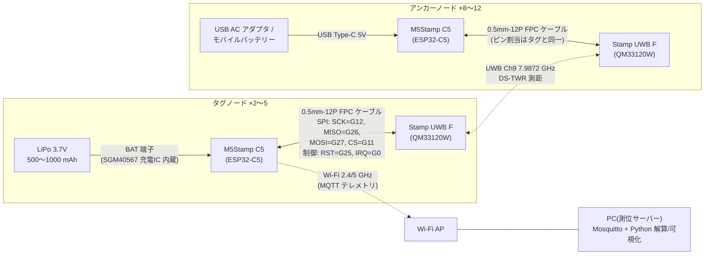
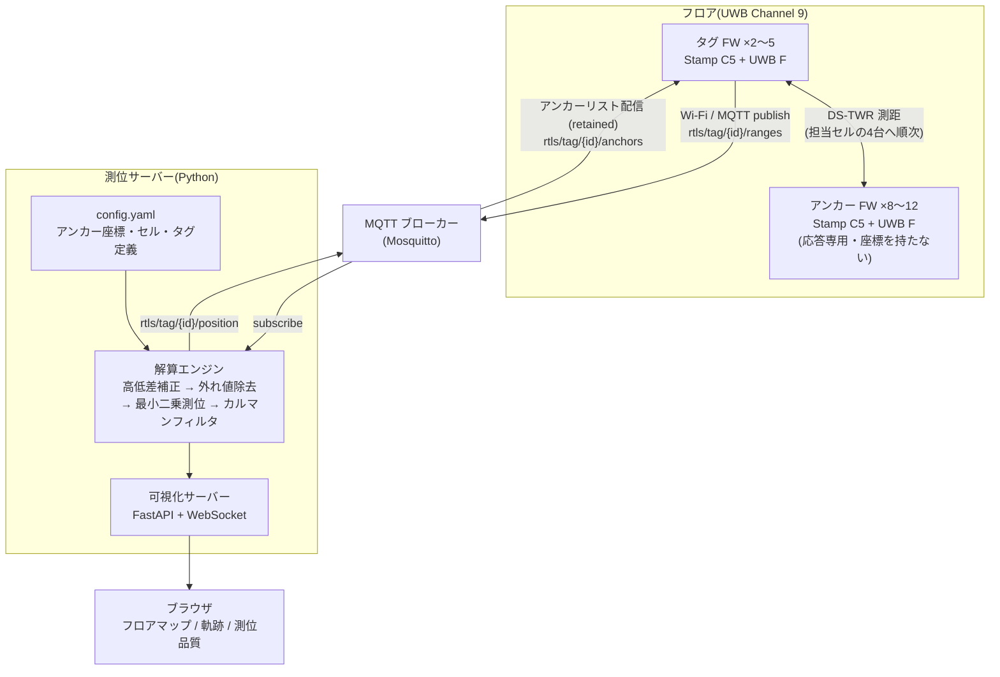

# M5Stamp UWB屋内RTLS測位システム設計書

- 作成日: 2026-08-15
- ステータス: ドラフト(実装前レビュー用)

## 1. システム概要

M5Stack Stamp UWB(Qorvo QM33120W搭載)を用いて、屋内フロア(20〜50 m規模)で移動タグの2D位置をリアルタイムに推定するRTLS(Real-Time Locating System)を構築する。

### 要件

| 項目 | 目標値 |
|---|---|
| 測位エリア | 屋内20〜50 m四方(単一フロア、2D) |
| タグ数 | 2〜5台(同時測位) |
| 測位精度 | 実用30 cm程度(見通し時。DS-TWRの測距誤差は約0.14 m) |
| 更新レート | タグあたり1〜2 Hz(初期目標。チューニングで向上余地あり) |
| アンカー数 | 8〜12台(セル分割、1セルあたり4台を標準。解算の下限は3台) |
| 出力 | 各タグの(x, y)座標。PC上でリアルタイム可視化 |

### 前提となる調査結果

- Stamp UWBは**SPI接続の測距モジュールで単体動作不可**。ホストMCUが必須で、公式ライブラリ([m5stack/M5Stamp-UWB](https://github.com/m5stack/M5Stamp-UWB))のデフォルトホストはM5Stamp C5(ESP32-C5)。
- 公式ライブラリはArduino用で、提供サンプルは**SS-TWR / DS-TWRの1対1測距のみ**(`SS_TWR_TAG/ANCHOR`, `DS_TWR_TAG/ANCHOR`)。マルチアンカー測位・TDoA・マルチタグのスケジューリングは**未提供のため本設計で自作**する。
- 主要API: `requestRange()` / `respondRange()`(SS-TWR)、`requestDSRange()` / `respondDSRange()`(DS-TWR)。測距コンフィグでPAN ID・自局/相手局ショートアドレスを指定でき、結果構造体から距離(mm/m)・シーケンス番号・成否を取得できる。→ **相手アドレスを切り替えながら複数アンカーへ順次測距する方式が素直に実装可能**。
- 仕様(公式ドキュメント): UWB Channel 9(中心7987.2 MHz)、IEEE 802.15.4-2020 / 802.15.4z-2020 BPRF、DS-TWR測距誤差約0.14 m、見通し最大約55 m、データレート850 kbps / 6.81 Mbps。

## 2. 測位方式の選定

**採用: DS-TWR(Double-Sided Two-Way Ranging)+ 最小二乗マルチラテレーション(三辺測量)**

| 方式 | 概要 | 判定 | 理由 |
|---|---|---|---|
| **DS-TWR** | タグ⇔アンカー間で往復2回のメッセージ交換によりToFを測定 | ✅ 採用 | クロックドリフトの影響を相殺でき精度が高い(~0.14 m)。公式サンプルあり。アンカー間の時刻同期不要 |
| SS-TWR | 往復1回の簡易版 | △ 予備 | エアタイムは短いがクロックオフセットの影響で精度が落ちる。エアタイム逼迫時の代替として温存 |
| TDoA | タグは1回ブリンク送信、複数アンカーの受信時刻差から測位 | ❌ 不採用 | タグ側は省電力・多タグに強いが、**アンカー間のナノ秒級クロック同期(有線同期または無線同期プロトコル)が必要**で、公式ライブラリに機能がなく開発規模が跳ね上がる。タグ2〜5台ならTWRで十分 |

タグ主導で各アンカーに順次DS-TWRを行い、得られた距離セット {d₁…dₙ} から2D座標を最小二乗法で解く。

→ 方式別の詳細設計: **[ds-twr-design.md](ds-twr-design.md)**(採用)/ **[ss-twr-design.md](ss-twr-design.md)**(予備・切替条件)/ **[tdoa-design.md](tdoa-design.md)**(将来・実現条件)

## 3. ハードウェア構成

### 3.1 ノード構成(アンカー・タグ共通の基本ユニット)

**M5Stamp C5 + M5Stamp UWB F(FPC版)を付属の0.5mm-12P FPCケーブルで直結**する。

- Stamp C5の背面FPCコネクタ(G23, G0, G24, G25, G26, G27, G11, G12)と、公式サンプルのピン割当(SCK=G12, MISO=G26, MOSI=G27, CS=G11, RST=G25, IRQ=G0, WAKEUP=G24, GP7=G23)が一致しており、**はんだ付け不要で公式サンプルがそのまま動く、メーカー想定の組み合わせ**。
- 無印版Stamp UWB(キャスタレーション実装)は量産・独自基板化フェーズ向け。プロトタイプではFPC版を推奨。

**接続関係図:**


```mermaid
flowchart LR
    subgraph tagnode["タグノード ×2〜5"]
        LIPO["LiPo 3.7V<br/>500〜1000 mAh"]
        C5T["M5Stamp C5<br/>(ESP32-C5)"]
        UWBT["Stamp UWB F<br/>(QM33120W)"]
        LIPO -- "BAT 端子<br/>(SGM40567 充電IC 内蔵)" --> C5T
        C5T <-- "0.5mm-12P FPC ケーブル<br/>SPI: SCK=G12, MISO=G26,<br/>MOSI=G27, CS=G11<br/>制御: RST=G25, IRQ=G0" --> UWBT
    end
    subgraph anchornode["アンカーノード ×8〜12"]
        AC["USB AC アダプタ /<br/>モバイルバッテリー"]
        C5A["M5Stamp C5<br/>(ESP32-C5)"]
        UWBA["Stamp UWB F<br/>(QM33120W)"]
        AC -- "USB Type-C 5V" --> C5A
        C5A <-- "0.5mm-12P FPC ケーブル<br/>(ピン割当はタグと同一)" --> UWBA
    end
    UWBT <-. "UWB Ch9 7.9872 GHz<br/>DS-TWR 測距" .-> UWBA
    C5T -. "Wi-Fi 2.4/5 GHz<br/>(MQTT テレメトリ)" .-> AP["Wi-Fi AP"]
    AP --- PC["PC(測位サーバー)<br/>Mosquitto + Python 解算/可視化"]
```

FPCケーブル1本でSPI 5線+制御2線+電源がまとまるため、ノード側の配線作業は「FPCを挿すだけ」。アンカーはWi-Fi接続不要(§4.3)なので、給電とUWB応答のみのスタンドアロン動作。

| 役割 | 構成 | 電源 |
|---|---|---|
| アンカー(8〜12台) | Stamp C5 + Stamp UWB F | USB Type-C給電(USB ACアダプタまたはモバイルバッテリー常時給電) |
| タグ(2〜5台) | Stamp C5 + Stamp UWB F | 3.7 V LiPoバッテリー(Stamp C5はSGM40567充電IC内蔵、電池端子あり) |
| サーバー | PC 1台(常設ならRaspberry Piでも可) | — |
| ネットワーク | 2.4/5 GHz Wi-Fi AP(既設流用可) | — |

### 3.2 BOM(概算)

| 品目 | 単価(USD) | 数量 | 小計 |
|---|---|---|---|
| M5Stamp UWB F(FPCケーブル付属) | $24.50 | 13〜17 | $319〜417 |
| M5StampC5 | $6.50 | 13〜17 | $85〜111 |
| タグ用LiPoバッテリー(3.7 V 500〜1000 mAh) | ~$5 | 2〜5 | ~$25 |
| タグ用ケース、アンカー取付具(3Dプリント等) | — | 一式 | ~$50 |
| USB ACアダプタ+ケーブル(アンカー用) | ~$5 | 8〜12 | ~$60 |
| **合計** | | | **約 $540〜660** |

数量 = アンカー8〜12 + タグ2〜5。予備を1〜2セット追加推奨。校正用にレーザー距離計(アンカー座標の測量に使用)があると良い。

### 3.3 アンカー配置設計

50×50 mを一度にカバーせず、**15〜25 m四方のセルに分割**し、セルごとに4台のアンカーを矩形の四隅に配置する。隣接セルとはアンカーを共有(辺上のアンカーは両セルに属する)。

```
50m フロアの例(●=アンカー、9台で4セル):
●----------●----------●
|  セル A   |  セル B   |
|          |          |
●----------●----------●
|  セル C   |  セル D   |
|          |          |
●----------●----------●
```

配置の指針:

- **高さ1.8〜2.5 m**に統一して壁面・柱に設置(人体・什器による遮蔽を減らす)。2D測位ではアンカー高さとタグ高さの差が水平距離誤差になるため、タグの想定高さ(例: 人の腰 ~1.0 m)との高低差補正を解算時に行う(√(d² − Δz²)で水平距離化)。
- タグから見て**アンカーが一方向に偏らない**こと(DOP悪化を防ぐ)。セル内のどこでも4台への見通しが確保できる位置を選ぶ。
- **アンテナ部を遮らない**: 公式ドキュメントの要求どおり、アンテナ端が金属・壁から離れるよう突き出して取り付ける。金属板への直付けは禁止。
- 各アンカーの設置座標はレーザー距離計で測量し、±3 cm以内でサーバーの設定ファイルに登録する(アンカー座標誤差はそのまま測位誤差になる)。

### 3.4 電波環境

- UWB Channel 9(7.9872 GHz)とWi-Fi(2.4/5 GHz)は周波数帯が離れており干渉しない。テレメトリに5 GHz Wi-Fi(ESP32-C5はWi-Fi 6対応)を使えば2.4 GHzの混雑も回避できる。
- **日本国内での利用**: UWB 7.25〜9.0 GHz帯は干渉回避機能なしで屋内利用可能な帯域でありCh9はこの範囲内。ただし**本製品は2026-08-14リリース直後のため、技適(工事設計認証)の取得状況を購入前に必ず確認すること**(未取得の場合、実験目的でも「技適未取得機器の実験等特例制度」の届出が必要)。

## 4. ソフトウェア構成

### 4.1 全体アーキテクチャ


```mermaid
flowchart TB
    subgraph floor["フロア(UWB Channel 9)"]
        TAG["タグ FW ×2〜5<br/>Stamp C5 + UWB F"]
        A1["アンカー FW ×8〜12<br/>Stamp C5 + UWB F<br/>(応答専用・座標を持たない)"]
    end
    TAG <-- "DS-TWR 測距<br/>(担当セルの4台へ順次)" --> A1
    TAG -- "Wi-Fi / MQTT publish<br/>rtls/tag/{id}/ranges" --> BR["MQTT ブローカー<br/>(Mosquitto)"]
    BR -- "アンカーリスト配信 (retained)<br/>rtls/tag/{id}/anchors" --> TAG
    subgraph server["測位サーバー(Python)"]
        ENG["解算エンジン<br/>高低差補正 → 外れ値除去<br/>→ 最小二乗測位 → カルマンフィルタ"]
        CFG["config.yaml<br/>アンカー座標・セル・タグ定義"]
        VIZ["可視化サーバー<br/>FastAPI + WebSocket"]
    end
    BR -- "subscribe" --> ENG
    CFG --> ENG
    ENG -- "rtls/tag/{id}/position" --> BR
    ENG --> VIZ
    VIZ --> UI["ブラウザ<br/>フロアマップ / 軌跡 / 測位品質"]
```

リポジトリ構成(現状の全体像は[development.md](development.md) §6を参照):

```
m5stamp_uwb_rtls/
├── docs/rtls-design.md          # 本書
├── firmware/
│   ├── anchor/  tag/            # アンカー / タグ FW (PlatformIO)
│   ├── lib/rtls_common/         # アドレス表・スロット定義の共有ヘッダ
│   └── lib/rtls_solver/         # B案 C++ ソルバー (tag-design.md)
├── server/
│   ├── positioning/             # 解算エンジン (numpy/scipy)
│   ├── web/                     # Web ダッシュボード (FastAPI + Canvas UI)
│   └── config.yaml              # アンカー座標・セル・タグ定義
└── tools/                       # シミュレータ・仮想タグ・Step 1 計測ツール
```

開発環境はPlatformIO(Arduinoフレームワーク、`board = esp32-c5`系)+ 公式M5Stamp-UWBライブラリ。

### 4.2 アドレス体系

| 種別 | 値 |
|---|---|
| PAN ID | 0xDECA(全ノード共通) |
| アンカー | 0x0010〜0x001B(最大12台。下位4 bit = アンカー番号) |
| タグ | 0x0001〜0x0005 |

アドレスと設置座標の対応はサーバーの`config.yaml`で一元管理。FWにはアドレスのみ書き込む(ビルドフラグ`-DNODE_ADDR=0x0011`で個体差し替え)。

### 4.3 アンカーFW

役割は「自分宛の測距要求に応答するだけ」。座標も状態も持たない、最も単純なノード。

- `begin()`後、ループで`respondDSRange()`を呼び続ける(自局アドレス宛のDS-TWR要求に応答)。
- Wi-Fiは不要(オプションで死活監視用にMQTTへheartbeatをpublishしても良い)。
- 公式`DS_TWR_ANCHOR`サンプルがほぼそのまま流用できる。

### 4.4 タグFWとマルチタグTDMAスケジューリング

タグは「スロットが来たら、担当セルのアンカー4台へ順次DS-TWR → 距離セットをMQTTでpublish」を繰り返す。

**TDMAスーパーフレーム設計(タグ5台・更新2 Hz):**

```
スーパーフレーム 500 ms
├─ スロット1 (0〜90ms)    : タグ 0x0001 が測距
├─ スロット2 (100〜190ms) : タグ 0x0002 が測距
├─ ...
└─ スロット5 (400〜490ms) : タグ 0x0005 が測距
     各スロット内: アンカー4台 × (DS-TWR 1回 ≈ 5〜10 ms + 失敗時リトライ1回) + アンカー間ギャップ 3 × 2 ms
     スロット間ガードタイム 10 ms
```

- **時刻同期**: ナノ秒精度は不要(UWBの測距自体は同期不要)。スロット境界を守れる**±10 ms程度**で十分なので、タグはWi-Fi経由の**SNTP同期**を使い、`(現在時刻ms) mod 500`で自スロットを判定する。ESP32のSNTPはLAN内なら数ms精度が出るため成立する。同期方式の選定と運用設計は **§4.9**に定める。
- **フォールバック**: スロット外でアンカーが別タグに応答中でも、DS-TWRはアドレス指定型なので混信は「タイムアウト」として現れるだけ。タイムアウト時は乱数バックオフ後に1回だけリトライし、それでも失敗したアンカーは当該サイクルでは欠測扱いにする(3距離あれば解算可能)。
- タグ2〜3台で運用する場合はスロットを150〜200 msに広げ、更新レートを上げられる。

**アンカー選択ロジック(セル対応):**

1. タグはサーバーから現在の担当アンカーリスト(4〜6台)をMQTTのretainedメッセージで受け取る(`rtls/tag/<id>/anchors`)。
2. 通常はリスト先頭4台に測距。あるアンカーの連続失敗数が閾値(例: 5回)を超えたら、リスト内の予備アンカーに入れ替える。
3. **セルのハンドオーバーはサーバー主導**: 解算した位置がセル境界に近づいたら、サーバーが隣接セルのアンカーリストを配信し直す。タグ側は受信したリストに従うだけにして、FWのロジックを薄く保つ。

### 4.5 測位アルゴリズム(サーバー側解算エンジン)

1. **高低差補正**: 斜距離dを水平距離 √(d² − Δz²)に変換(Δz = アンカー高 − タグ想定高)。
2. **外れ値除去**: NLoS(遮蔽)による距離の**伸び**が主誤差。前回位置から物理的にあり得ない距離(移動速度上限超え)や、最小二乗の残差が大きい距離を除外して再解算する(4距離中1つ除外しても3距離で解ける)。
3. **最小二乗マルチラテレーション**: 距離方程式を線形化して`numpy.linalg.lstsq`、または`scipy.optimize.least_squares`で非線形解法。3距離以上で解算、2距離以下のサイクルは欠測としてフィルタの予測値で補間。
4. **平滑化**: 等速直線運動モデルの**2Dカルマンフィルタ**(状態[x, y, vx, vy])。実装を軽くしたい初期段階は指数移動平均でも可。

### 4.6 テレメトリ伝送方式の選定(MQTTと代替案)

タグ→サーバーの距離データ伝送と、サーバー→タグのアンカーリスト配信(下り)には以下の選択肢がある。

| 方式 | 仕組み | 長所 | 短所 | 向くケース |
|---|---|---|---|---|
| **MQTT** ✅ 採用 | ブローカー経由のpub/sub | 下り配信がretainedメッセージで自然に書ける。ロガー・可視化など**購読者を後から追加**できる。ESP32実績豊富(PubSubClient / esp-mqtt) | ブローカー(Mosquitto)を1プロセス常駐させる必要 | 本システムの標準構成 |
| WebSocket直結 | タグ→FastAPIへ常時接続 | ブローカー不要でサーバー1プロセスに集約。双方向なので下り配信も可 | 再接続・複数購読者・メッセージ保持をすべて自作。データ記録も自前 | 構成要素を極小化したい小規模構成 |
| HTTP POST | 測距サイクルごとにRESTで送信 | 最も単純。デバッグがcurlで済む | **下り(アンカーリスト)がポーリングになる**。接続オーバーヘッドが毎回かかる | 下り不要な1セル・固定アンカー構成 |
| 生UDP | JSON/バイナリをUDP datagramで送信 | 最軽量・最低遅延。欠測を許容する測距データと相性が良い | 到達保証なし。下り経路・タグ死活管理を自作。将来のNAT越え不可 | 更新レート最優先のチューニング段階 |
| ESP-NOW + ブリッジ | タグ→受信専用ESP32(PCにUSBシリアル接続)へWi-Fi APなしで直送 | **Wi-Fiインフラ不要**。接続確立が不要で低遅延・低電力 | ブリッジノードの製作が必要。50m級では中継配置の検討も必要。下り配信も自作 | 会場にWi-Fiを用意できない現場 |
| UWBバックホール | ライブラリの`sendFrame()`/`receiveFrame()`で距離データをUWBフレーム送信し、PC接続のリスナーノードで回収 | タグからWi-Fiを排除でき省電力。無線がUWBのみで完結 | **測距用エアタイムを圧迫**しTDMA設計が複雑化。リスナー+シリアルブリッジ自作。帯域小 | タグ電池持ちが最優先で更新レートを落とせる場合 |
| BLE | タグ→BLEゲートウェイ | 省電力 | 50mフロアでは到達距離・ローミングが厳しく、ゲートウェイ多数が必要 | ❌ 本用途には不適 |

**MQTTを採用する決め手**は、(1)セルハンドオーバーに必須の下り配信(§4.4)がretainedメッセージでそのまま実現できること、(2)生距離の記録・再解析(§5 A案の利点)が「ロガーを1購読者追加」で済むこと。代替として有力なのは、ブローカーも省きたい小規模構成での**WebSocket直結**と、Wi-Fiインフラが用意できない現場での**ESP-NOW + シリアルブリッジ**。いずれもタグFWの送信層を差し替えるだけで移行できるよう、FW内では「距離セットの生成」と「送信」を分離しておく。

### 4.7 MQTTトピック・メッセージ設計

| トピック | 方向 | 内容 |
|---|---|---|
| `rtls/tag/<id>/ranges` | タグ → サーバー | 1サイクル分の距離セット |
| `rtls/tag/<id>/anchors` | サーバー → タグ(retained) | 担当アンカーリスト |
| `rtls/tag/<id>/position` | サーバー → 可視化/外部 | 解算済み座標 |
| `rtls/anchor/<id>/status` | アンカー → サーバー | heartbeat(オプション) |

`ranges`ペイロード例:

```json
{"tag":"0x0001","seq":1234,"t_ms":1755212345678,
 "ranges":[{"a":"0x0010","d_mm":5234,"ok":true},
           {"a":"0x0011","d_mm":7810,"ok":true},
           {"a":"0x0012","d_mm":3120,"ok":true},
           {"a":"0x0013","d_mm":0,"ok":false}]}
```

`position`ペイロード例:

```json
{"tag":"0x0001","t_ms":1755212345690,"x_m":12.34,"y_m":8.76,
 "quality":{"n_anchors":3,"residual_m":0.08},"cell":"A"}
```

### 4.8 可視化

PythonサーバーにFastAPI + WebSocketを同居させ、ブラウザでフロア図(SVG/Canvas)上にタグをリアルタイム描画する。開発初期はmatplotlibのライブプロットでも十分。表示項目: タグ位置と軌跡、使用アンカー、残差(測位品質)、欠測アンカーの警告。

### 4.9 時刻同期設計

**要件整理** — 必要な精度は用途で大きく異なる:

| 用途 | 必要精度 | 備考 |
|---|---|---|
| UWB測距そのもの(DS-TWR) | **同期不要** | 往復時間差で解くため。DS-TWRを選んだ利点そのもの |
| TDMAスロット境界の遵守 | ±10 ms程度 | ガードタイム10 msを守れればよい |
| 測距データのタイムスタンプ(カルマンdt、鮮度判定、タグ間整合) | ~10 ms | 歩行2 m/s × 10 ms = 2 cmで、測距誤差0.14 mに対し十分小さい |

**ナノ秒級の同期は一切不要で、ms級で足りる。** その前提での方式比較:

| 方式 | 精度 | 判定 | 理由 |
|---|---|---|---|
| **SNTP(LAN内NTPサーバー)** | LAN内1〜5 ms | ✅ 採用 | 測位サーバーのホストにchronyを立て、タグはそこへ同期。ESP32標準機能で実装コストほぼゼロ |
| サーバー受信時刻で代用(`recv_ms`) | 10〜100 ms | ❌ | タグ側同期が不要になる代わりにWi-Fi+ブローカーのジッタがそのまま時刻誤差になり、dtが乱れカルマンに悪影響。スロット判定にも使えない |
| Wi-Fi TSF(同一APのビーコン時刻) | µs級 | △ 将来枠 | `esp_wifi_get_tsf_time()`で同一AP配下のタグが µs級共有クロックを持てる。スロット精度を詰めたくなった時のアップグレード。日時そのもの(壁時計時刻)は得られないためSNTPと併用になる |
| PTP(IEEE 1588) | sub-µs | ❌ | ハードウェアタイムスタンプはEthernet前提で、Wi-Fi接続のESP32-C5では精度が出ず過剰 |
| UWBフレーム同期(アンカービーコン基準) | ns級 | ❌ | TDoAへ移行する場合に初めて必要。TWR構成では不要 |

**採用設計(SNTPを軸に3点):**

1. **測位サーバーのホストにchronyを同居**させ、タグはLAN内でそこへ同期する。インターネットNTPには出さない(精度もオフライン耐性もLAN完結が上)。
2. **再同期は5分毎、補正は時刻を一気に合わせるステップ補正ではなく徐々に合わせるスルー補正(slew)** とする。5分毎にするのは、ESP32の水晶が ±20 ppm程度あり、15分放置すると最大 ~18 msドリフトして ±10 msのスロット予算を食い潰すため(5分なら最大 ~6 ms。前回同期とのずれからドリフト率を一次推定して補正すれば ~2 msに抑えられる)。ステップ補正を避けるのは、時刻が飛ぶとスロット判定`(t mod 500)`が瞬間的に他タグのスロットへ跳ぶため。
3. **サーバー側で`recv_ms − t_ms`の分布を常時監視**し(server-design.md §12)、特定タグだけ分布が偏ったら同期異常としてUIに警告する。同期の監視まで含めて運用設計とする。

## 5. 測位計算の配置: サーバー計算vsタグ上計算

| 観点 | A案: サーバー計算(タグは距離のみ送信) | B案: タグ上計算(座標を送信) |
|---|---|---|
| アルゴリズム改善 | ◎ Pythonで外れ値除去・フィルタを再起動なしに試行錯誤できる。**生距離ログが残るため後からアルゴリズムを差し替えて再解析可能** | △ FW書き換え+全タグへのOTA/書き込みが毎回必要 |
| デバッグ性 | ◎ 距離の生値・残差・除外判定をすべて観測できる | △ 座標しか見えず、誤差の原因(どのアンカーの距離が狂ったか)を追えない |
| レイテンシ | ○ Wi-Fi+ブローカー経由で +10〜50 ms(可視化用途では無視できる) | ◎ タグ内で完結 |
| タグ消費電力 | ○ どちらもWi-Fi送信は必要。ペイロード差は誤差レベル | ○ 解算の計算負荷はESP32-C5には軽微 |
| スタンドアロン性 | △ サーバー必須 | ◎ タグ単体で自位置を利用可(ロボット搭載など) |
| セル管理・マルチタグ協調 | ◎ アンカーリスト配信・ハンドオーバーと同じ場所に集約できる | △ 全アンカー座標を各タグに配布・更新する仕組みが別途必要 |
| スケーラビリティ | ◎ タグ追加はサーバー設定のみ | △ タグごとに設定書き込み |

**推奨: A案(サーバー計算)。** 本システムの難所は解算アルゴリズムのチューニング(NLoS対策・フィルタ)であり、そこをPython側に置けるA案は開発効率で圧倒的に有利になる。中規模エリアで必須になるセル管理・ハンドオーバーもサーバー主導設計(§4.4)と整合する。B案はタグが自律移動体(ロボット)に載り、タグ自身が座標を必要とする場合の将来拡張として位置づける。その場合も「距離は必ずMQTTにも流す」設計にしておけば移行できる。

→ **A案の詳細設計は[server-design.md](server-design.md)、B案の詳細設計は[tag-design.md](tag-design.md)を参照。**

## 6. キャリブレーションと精度対策

1. **アンテナ遅延校正**: 既知距離(例: 正確に5.000 m)にタグ・アンカーを置いて多数回測距し、オフセット(実測 − 真値)をノードごとに求める。QM33120Wのアンテナ遅延レジスタで補正するか、簡易にはサーバー側でノード別バイアス表(`config.yaml`)として引き算する。全アンカー×代表タグの組で実施。
2. **アンカー座標測量**: レーザー距離計で基準点からの距離を測り座標化。±3 cm目標。
3. **NLoS対策**: 人体・金属什器による遮蔽では距離が**伸びる**方向に誤差が出る。§4.5の残差ベース外れ値除去に加え、恒常的に遮蔽されるエリアがあればアンカー増設・位置変更で対処。
4. **静的テスト → 動的テスト**: 既知座標のグリッド上にタグを静置して誤差マップを作成(受入基準: 見通し環境でCEP50 ≤ 30 cm)、その後歩行試験で軌跡の滑らかさとハンドオーバーを確認。

## 7. リスクと制約

| リスク | 影響 | 対策 |
|---|---|---|
| **技適未取得の可能性**(2026-08-14発売直後) | 日本国内で電波を出せない | 購入前に技適番号を確認。未取得なら特例制度の届出を行い実験室内で使用 |
| 公式ライブラリが新しく実績が薄い | API変更・不具合 | バージョンを固定(library.jsonのタグ指定)。1対1測距の動作検証を最初のマイルストーンにする |
| DS-TWRのエアタイム逼迫(タグ・アンカー増加時) | 更新レート低下 | 本設計の上限はタグ5台×2 Hz程度。それ以上はスロット延長で更新レートを犠牲にするか、TDoA化(大規模改修)を検討 |
| SNTP同期のずれによるスロット衝突 | 測距失敗率上昇 | ガードタイム10 ms+乱数バックオフリトライで吸収。失敗率をサーバーで監視 |
| NLoSが多い環境(棚・金属壁) | 精度劣化 | アンカー密度を上げる(セルを小さくする)。誤差マップで問題エリアを特定 |
| タグの電池持ち | 運用性 | DS-TWR+Wi-Fi常時接続では実測が必要。短ければ測距間隔の動的調整(静止検出でレート低下)、Wi-Fi送信のバッチ化を検討 |

## 8. 実装ロードマップ

1. **Step 1 — 1対1測距検証(まずここから)**: 公式`DS_TWR_TAG/ANCHOR`サンプルを2ノードで動かし、既知距離での誤差・成功率・1回の測距所要時間を実測する。**この実測値で §4.4のスロット設計を確定させる。**
2. **Step 2 — 1タグ × 4アンカー2D測位**: タグFWにアンカー巡回を実装、MQTT送信、サーバーで最小二乗解算+可視化。1セル(〜20 m四方)で精度評価。
3. **Step 3 — マルチタグTDMA**: SNTPスロット同期を実装し、タグ2〜5台での測距成功率・更新レートを評価。
4. **Step 4 — 中規模展開**: セル分割・アンカーリスト配信・ハンドオーバーを実装し、フロア全域で試験。誤差マップ作成と校正。

## 9. 補足: 市販タグ(AirTag等)との相互運用性

**AirTagなどの市販トラッカーは本システムのタグとして扱えない。** 同じUWBでも、測距が成立するには両端が同じ測距プロトコルを話す必要がある。本設計のアンカーはM5Stamp-UWBライブラリ独自のTWRフレームで応答するが、市販トラッカーはこれに応答しない。

- AirTagのUWB測距(Precision Finding)は**Apple独自プロトコルで、U1/U2チップ搭載iPhoneとの間でのみ**動作する。セッション確立はFind Myネットワークの暗号化BLE交換で行われ、サードパーティのアンカーがAirTagとTWRセッションを張る手段は公開されていない。
- プライバシー保護のためBLE識別子も約15分ごとにローテーションし、個体の継続追跡はできない(意図的な設計)。
- TileなどBLEのみのトラッカーはUWBを持たず、RSSIによる近接判定程度しかできない(30 cm級測位は不可能)。

市販デバイスを絡めたい場合の選択肢:

| 選択肢 | 実現性 | 内容 |
|---|---|---|
| **本設計のまま自作タグ** | ◎ | Stamp C5 + UWB F(~$31/台)。プロトコルを完全に制御でき、AirTagより安い |
| Androidスマホをタグ化 | △ 大規模開発 | UWB搭載Android(Pixel Pro / Galaxy Ultra等)はFiRa標準の測距APIを公開している。ただしアンカー側に**FiRaプロファイル(BLE帯域外セッション確立含む)の実装**が必要で、公式ライブラリの範囲を大きく超える。QM33120W自体はFiRa対応チップなので不可能ではない、という位置づけ |
| iPhoneと連携 | △ 方向が逆 | Apple Nearby Interactionはサードパーティ製アクセサリとの測距をサポートし、QorvoがDW3xxx向け対応SDKを提供している。ただし「iPhoneが自分の位置からアクセサリを測る」構図であり、複数アンカーでiPhoneを常時測位するRTLSには設計上向かない |
| 市販RTLS専用タグ | △ 別システム | Qorvo DWM3001系などの市販RTLSタグはベンダー独自プロトコル(またはFiRa)で動作し、本システムのアンカーとは相互運用できない。採用するならアンカー含めベンダーのシステム一式へ乗り換える判断になる |

コンシューマ向けUWBトラッカーはエコシステム内(AirTag ⇔ iPhone、Galaxy SmartTag ⇔ Galaxy)に閉じており、汎用RTLSのタグとしては開放されていない。追跡対象に取り付ける用途では**自作タグが最も確実で安価**、というのが本設計の前提。

## 参考リンク

- 製品ドキュメント: https://docs.m5stack.com/en/stamp/Stamp_UWB
- 公式ライブラリ: https://github.com/m5stack/M5Stamp-UWB
- Stamp UWB F(FPC版・$24.50): https://shop.m5stack.com/products/m5stamp-uwb-module-with-fpc-qm33120w
- M5StampC5($6.50): https://shop.m5stack.com/products/m5stampc5-module-esp32-c5
- Stamp C5ドキュメント: https://docs.m5stack.com/en/core/Stamp-C5
