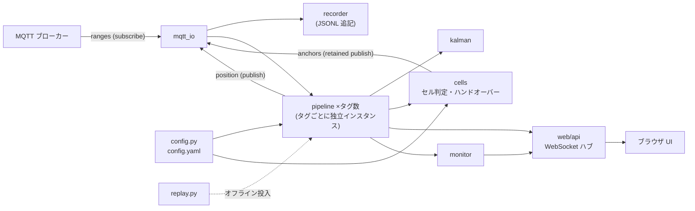
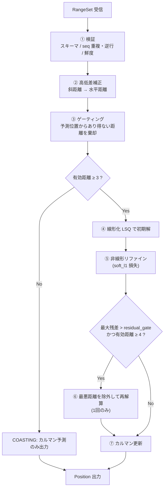
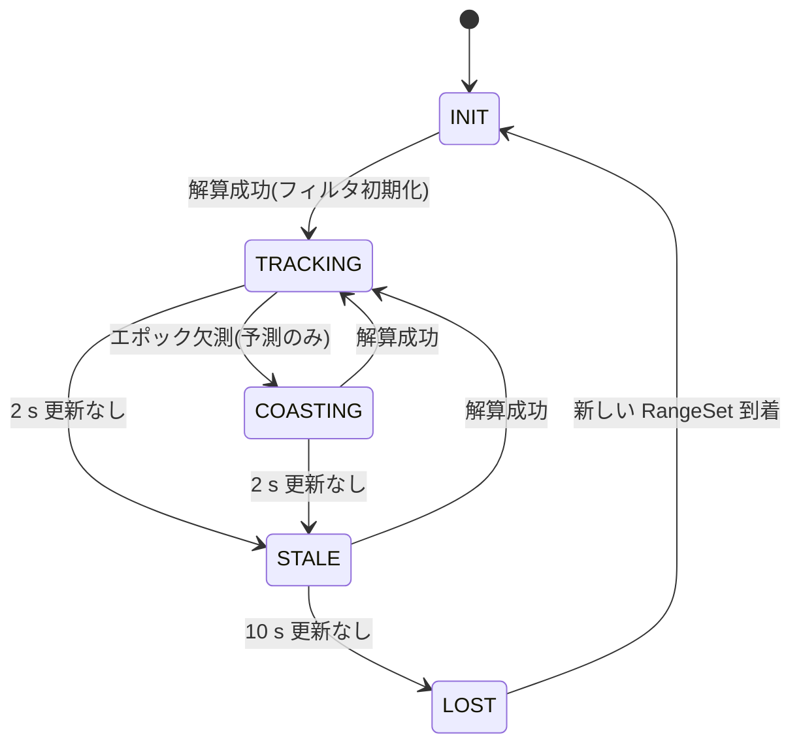
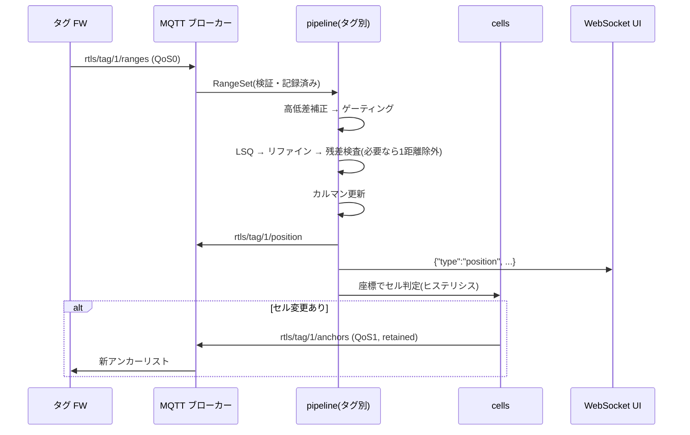

# 測位サーバー詳細設計書(A案: サーバー計算)

- 作成日: 2026-08-15
- ステータス: ドラフト(実装前レビュー用)
- 上位文書: [rtls-design.md](rtls-design.md)(基本設計 §5で採用した「A案: サーバー計算」の詳細設計)

## 1. スコープと責務

本書は、タグからMQTTで届く**生距離セット**を入力とし、**フィルタ済み2D座標**と**アンカーリスト配信(セルハンドオーバー)**を出力する測位サーバーの詳細設計を定める。

| 責務 | 内容 |
|---|---|
| 距離データ受信 | `rtls/tag/{id}/ranges`の購読、スキーマ検証、鮮度チェック |
| 解算 | 高低差補正 → ゲーティング → 最小二乗測位 → 残差ベース外れ値除去 → カルマンフィルタ |
| セル管理 | タグ位置からセルを判定し、担当アンカーリストをretained配信(ヒステリシス付き) |
| 記録・再生 | 生距離のJSONL記録と、記録からのオフライン再解析(リプレイ) |
| 可視化・API | WebSocketによるリアルタイム配信、RESTによる状態参照 |
| 監視 | タグ死活(STALE/LOST)、アンカー欠測率、解算品質の集計 |

**非スコープ**: ファームウェア、MQTTブローカー自体の運用設計、認証・マルチテナント。

## 2. 技術スタックと動作環境

| 項目 | 選定 | 理由 |
|---|---|---|
| 言語 / ランタイム | Python 3.12+、単一プロセスasyncio | タグ5台×2Hz = 最大10 msg/sと負荷が軽く、プロセス分割は不要 |
| MQTTクライアント | aiomqtt | asyncioネイティブ。再接続ループを自前で書ける |
| 数値計算 | numpy / scipy | 線形化LSQと`scipy.optimize.least_squares` |
| 設定・検証 | pydantic v2 + YAML | `config.yaml`と受信JSONのスキーマ検証を同じ機構で行う |
| Web / 可視化 | FastAPI + uvicorn、WebSocket | 解算プロセスに同居させ、追加ブローカー不要 |
| 配布 | venv + `pip install -e .`(常設時はDocker ComposeでMosquittoと同梱) | |
| 時刻同期基盤 | **chrony(NTPサーバー)をサーバーホストに同居** | タグのSNTP同期先(rtls-design.md §4.9)。インターネットNTP非依存でLAN完結 |

## 3. モジュール構成

```
server/
├── app.py                  # エントリポイント: 各タスクの起動・停止
├── config.py               # config.yaml の読込・pydantic 検証
├── models.py               # RangeSet / Position / TagState 等のデータ型
├── mqtt_io.py              # aiomqtt の購読/publish ラッパ(再接続込み)
├── positioning/
│   ├── pipeline.py         # タグごとの解算パイプライン(本書 §5)
│   ├── geometry.py         # 高低差補正・線形化LSQ・非線形リファイン
│   ├── outlier.py          # ゲーティングと leave-one-out 除去
│   └── kalman.py           # 等速モデル 2D カルマンフィルタ
├── cells.py                # セル判定・ハンドオーバー(ヒステリシス)
├── recorder.py             # 生距離 JSONL 記録
├── replay.py               # 記録の再生(MQTT を介さず pipeline へ直接投入)
├── monitor.py              # タグ死活・アンカー欠測率の集計
├── web/
│   ├── api.py              # FastAPI: REST + WebSocket
│   └── static/             # フロアマップ UI (単一 HTML + Canvas)
└── config.yaml
```


```mermaid
flowchart LR
    BR["MQTT ブローカー"] -- "ranges (subscribe)" --> IO["mqtt_io"]
    IO --> REC["recorder<br/>(JSONL 追記)"]
    IO --> PL["pipeline ×タグ数<br/>(タグごとに独立インスタンス)"]
    CFG["config.py<br/>config.yaml"] --> PL
    CFG --> CELLS
    PL --> KF["kalman"]
    PL --> CELLS["cells<br/>セル判定・ハンドオーバー"]
    CELLS -- "anchors (retained publish)" --> IO
    PL -- "position (publish)" --> IO
    PL --> HUB["web/api<br/>WebSocket ハブ"]
    MON["monitor"] --> HUB
    PL --> MON
    HUB --> UI["ブラウザ UI"]
    RP["replay.py"] -. "オフライン投入" .-> PL
```

設計原則: **pipelineはMQTTを知らない**(入出力は`models.py`の型のみ)。これによりreplay・単体テストがMQTTなしで動く。

## 4. データモデル(models.py)

```python
@dataclass(frozen=True)
class Range:
    anchor: int          # ショートアドレス (例 0x0010)
    d_mm: int            # 斜距離。ok=False のとき無効
    ok: bool

@dataclass(frozen=True)
class RangeSet:          # rtls/tag/{id}/ranges 1件に対応
    tag: int
    seq: int
    t_ms: int            # タグ側タイムスタンプ (SNTP 同期済み)
    recv_ms: int         # サーバー受信時刻
    ranges: tuple[Range, ...]

@dataclass(frozen=True)
class Position:          # rtls/tag/{id}/position 1件に対応
    tag: int
    t_ms: int
    x_m: float
    y_m: float
    vx_ms: float
    vy_ms: float
    n_used: int          # 解算に使った距離数
    residual_m: float    # 使用距離の RMS 残差
    cell: str
    state: TagTrackState # TRACKING / COASTING

class TagTrackState(Enum):
    INIT = auto()        # フィルタ未初期化
    TRACKING = auto()    # 通常追尾
    COASTING = auto()    # 当該エポック欠測、予測のみで出力
    STALE = auto()       # stale_sec 以上更新なし(UI 警告)
    LOST = auto()        # lost_sec 以上更新なし(UI 非表示)
```

## 5. 解算パイプライン(positioning/pipeline.py)

タグごとに1インスタンス。`process(rs: RangeSet) -> Position | None`を同期関数として実装する(1呼び出し < 1 ms想定、asyncioをブロックしない)。


```mermaid
flowchart TB
    IN["RangeSet 受信"] --> V["① 検証<br/>スキーマ / seq 重複・逆行 / 鮮度"]
    V --> H["② 高低差補正<br/>斜距離 → 水平距離"]
    H --> G["③ ゲーティング<br/>予測位置からあり得ない距離を棄却"]
    G --> N{"有効距離 ≥ 3 ?"}
    N -- "No" --> CO["COASTING: カルマン予測のみ出力"]
    N -- "Yes" --> LSQ["④ 線形化 LSQ で初期解"]
    LSQ --> REF["⑤ 非線形リファイン<br/>(soft_l1 損失)"]
    REF --> R{"最大残差 > residual_gate<br/>かつ有効距離 ≥ 4 ?"}
    R -- "Yes" --> LOO["⑥ 最悪距離を除外して再解算<br/>(1回のみ)"]
    LOO --> KF
    R -- "No" --> KF["⑦ カルマン更新"]
    CO --> OUT
    KF --> OUT["Position 出力"]
```

### ① 検証

- pydanticでJSONスキーマ検証。不正メッセージは破棄しカウンタ加算。
- `seq`が前回以下なら破棄(再送・順序逆転)。
- `recv_ms - t_ms > max_age_ms`(既定500 ms)なら破棄(滞留した古いデータでフィルタを汚さない)。

### ② 高低差補正(geometry.py)

アンカー高`z_a`、タグ想定高`z_t`(configで指定、既定1.0 m)として、斜距離dを水平距離に変換:

```
r = sqrt(max(d² − (z_a − z_t)², 0))    # 根号内が負なら r=0 とし当該距離は棄却
```

### ③ ゲーティング(outlier.py)

カルマンが初期化済みのとき、予測位置`p̂`から各アンカーへの予測距離`r̂_i`を計算し、

```
|r_i − r̂_i| > v_max × Δt + gate_margin_m   →  棄却
```

既定: `v_max = 2.0 m/s`(歩行想定)、`gate_margin_m = 0.6 m`(測距ノイズ3σ + 予測誤差の余裕)。INIT中はゲーティングをスキップ。

### ④⑤ 最小二乗測位(geometry.py)

**初期解(線形化LSQ)**: アンカーi=1を基準にi=2..nについて

```
2(x_i − x_1)x + 2(y_i − y_1)y = (x_i² − x_1²) + (y_i² − y_1²) + (r_1² − r_i²)
```

を立て、`numpy.linalg.lstsq`で解く(n=3で一意、n≥4で過決定)。

**リファイン**: 初期解を出発点に`scipy.optimize.least_squares`で残差`f_i(p) = ‖p − a_i‖ − r_i`を最小化。`loss='soft_l1', f_scale=0.3`で軽度のNLoS伸びに対しロバスト化。収束しない場合は線形解をそのまま採用しフラグを立てる。

### ⑥ 残差ベース外れ値除去

リファイン後の最大絶対残差が`residual_gate_m`(既定0.5 m)を超え、かつ有効距離が4以上のとき、**最悪の1距離を除外して④⑤を1回だけ再実行**する。改善しなければ元の解を採用(無限ループ・過剰除去の防止)。NLoSは距離が「伸びる」方向に出るため、残差が正に大きい距離を優先的に疑う。

### ⑦ カルマンフィルタ(kalman.py)

等速直線運動(CV)モデル。状態`x = [x, y, vx, vy]ᵀ`。

- 遷移: `F(dt)`は標準CV。プロセスノイズは加速度白色雑音`σ_a = 1.0 m/s²`(人の歩行変化を吸収)から`Q(dt)`を構成。
- 観測: 解算座標`z = [x, y]`。観測ノイズ`R = diag(σ_m², σ_m²)`、`σ_m = max(0.15, residual_m)`として**解算品質が悪いエポックほど信頼を下げる**。
- dtはタグ側`t_ms`の差分から算出(サーバー受信ジッタの影響を受けない)。
- 欠測エポック(有効距離 < 3)はpredictのみでCOASTING出力。`stale_sec`(既定2 s)連続でSTALE、`lost_sec`(既定10 s)でLOSTとし共分散をリセット、次の解でINITからやり直す。


```mermaid
stateDiagram-v2
    [*] --> INIT
    INIT --> TRACKING : 解算成功(フィルタ初期化)
    TRACKING --> COASTING : エポック欠測(予測のみ)
    COASTING --> TRACKING : 解算成功
    TRACKING --> STALE : 2 s 更新なし
    COASTING --> STALE : 2 s 更新なし
    STALE --> TRACKING : 解算成功
    STALE --> LOST : 10 s 更新なし
    LOST --> INIT : 新しい RangeSet 到着
```

## 6. セル管理とハンドオーバー(cells.py)

- セルは軸平行矩形 + 担当アンカーリスト(4〜6台)として`config.yaml`に定義。
- 判定はカルマン出力座標に対して行う。**ヒステリシス**: 現セルの矩形を`handover_margin_m`(既定2.0 m)外側に拡張した領域を出るまで現セルを維持し、境界での配信フラッピングを防ぐ。
- セルが変わったときのみ`rtls/tag/{id}/anchors`を**retained**でpublish(タグ再起動時も最後のリストを受け取れる)。
- LOSTタグには全セル横断の「初期取得用リスト」(フロア中央寄りのアンカー)を配信し、再捕捉を助ける。

## 7. MQTT入出力(mqtt_io.py)

| トピック | 方向 | QoS | retain | 備考 |
|---|---|---|---|---|
| `rtls/tag/+/ranges` | 購読 | 0 | — | 欠測許容データ。QoS1の再送はかえって古いデータを運ぶため使わない |
| `rtls/tag/{id}/position` | publish | 0 | false | 外部連携用。UIはWebSocket経由が主 |
| `rtls/tag/{id}/anchors` | publish | 1 | **true** | ハンドオーバー指示。確実に届け、新規接続タグにも即配信 |
| `rtls/anchor/+/status` | 購読 | 0 | — | heartbeat(任意)。monitorへ転送 |

再接続: 指数バックオフ(1→2→…→30 s上限)で永続リトライ。切断中のrangesは捨てる(リアルタイム性優先)。

## 8. 記録とリプレイ(recorder.py / replay.py)

- **記録**: 受信したrangesを検証前の生JSONのまま`logs/ranges-YYYYMMDD.jsonl`に追記(1行1メッセージ、`recv_ms`を付加)。日次ローテーション。5タグ × 2 Hz ≈ 15 MB/日程度。
- **リプレイ**: `python -m server.replay logs/ranges-20260815.jsonl --config config.yaml --speed 0`で、MQTTを介さずpipelineに直接投入し`positions.jsonl`を出力。`--speed 0`は最速一括処理(パラメータチューニング用)、`--speed 1`は実時間再生(UI確認用)。
- これがA案の核となる利点: **アルゴリズム変更の評価は常に同一ログに対するリプレイで行い、実機再測定を不要にする。**

## 9. Web API・可視化(web/api.py)

| エンドポイント | 内容 |
|---|---|
| `GET /api/floor` | フロア定義(寸法、セル矩形、アンカー座標)— UI初期化用 |
| `GET /api/tags` | 全タグの最新Positionと追尾状態 |
| `GET /api/stats` | アンカー別測距成功率、タグ別更新レート、破棄カウンタ |
| `WS /ws` | Positionと統計のpush配信(下記スキーマ) |

WebSocket配信メッセージ(MQTTのpositionペイロードに`"type":"position"`を加えた形):

```json
{"type":"position","tag":"0x0001","t_ms":1755212345690,
 "x_m":12.34,"y_m":8.76,"vx_ms":0.51,"vy_ms":-0.12,
 "quality":{"n_anchors":4,"residual_m":0.03},
 "anchors_used":["0x0010","0x0011","0x0013","0x0014"],"anchors_rejected":[],
 "cell":"A","state":"TRACKING"}
```

UI(`web/static/`、単一HTML + Canvas):フロア平面図にアンカー(●)、セル境界、タグ(現在位置+直近30秒の軌跡)、状態色(TRACKING=通常 / COASTING・STALE=警告 / LOST=非表示+一覧に警告)。追加ライブラリなしの素のCanvas描画とする。

## 10. config.yamlスキーマ

```yaml
mqtt:
  host: 192.168.1.10
  port: 1883
floor:
  width_m: 50.0
  height_m: 50.0
  tag_height_m: 1.0          # 高低差補正のタグ想定高
anchors:                     # ショートアドレスは 16 進文字列
  "0x0010": { x: 0.0,  y: 0.0,  z: 2.2, bias_mm: -35 }   # bias_mm: 校正オフセット
  "0x0011": { x: 25.0, y: 0.0,  z: 2.2, bias_mm: 12 }
  # ...
cells:
  A: { rect: [0, 0, 25, 25],  anchors: ["0x0010","0x0011","0x0013","0x0014"] }
  B: { rect: [25, 0, 50, 25], anchors: ["0x0011","0x0012","0x0014","0x0015"] }
  # ...
tags: ["0x0001", "0x0002", "0x0003"]
tuning:
  max_age_ms: 500
  v_max_ms: 2.0
  gate_margin_m: 0.6
  residual_gate_m: 0.5
  sigma_a: 1.0               # プロセスノイズ (m/s²)
  sigma_m_floor: 0.15        # 観測ノイズ下限 (m)
  stale_sec: 2.0
  lost_sec: 10.0
  handover_margin_m: 2.0
```

起動時検証: 各セルのアンカーが`anchors`に存在すること、セル矩形がフロア内に収まること、タグ・アンカーのアドレス重複がないことをpydanticバリデータで検査し、不備は起動失敗にする。

## 11. 処理シーケンス


```mermaid
sequenceDiagram
    participant T as タグ FW
    participant B as MQTT ブローカー
    participant P as pipeline(タグ別)
    participant C as cells
    participant W as WebSocket UI
    T->>B: rtls/tag/1/ranges (QoS0)
    B->>P: RangeSet(検証・記録済み)
    P->>P: 高低差補正 → ゲーティング
    P->>P: LSQ → リファイン → 残差検査(必要なら1距離除外)
    P->>P: カルマン更新
    P->>B: rtls/tag/1/position
    P->>W: {"type":"position", ...}
    P->>C: 座標でセル判定(ヒステリシス)
    alt セル変更あり
        C->>B: rtls/tag/1/anchors (QoS1, retained)
        B->>T: 新アンカーリスト
    end
```

## 12. エラー処理・監視(monitor.py)

| 事象 | 検出 | 応答 |
|---|---|---|
| 不正JSON / スキーマ違反 | pydantic検証失敗 | 破棄、タグ別カウンタ加算(UIの /api/statsで参照できる) |
| 古いデータ | `recv_ms − t_ms > max_age_ms` | 破棄。多発時はSNTPずれ警告(タグ時刻とサーバー時刻の差を統計表示) |
| アンカー欠測率上昇 | 直近5分のok=false率 > 30% | UI警告(設置物による遮蔽・電源断の兆候) |
| タグ無応答 | STALE / LOST遷移 | UI警告 / 非表示。LOSTタグへ初期取得用アンカーリスト配信 |
| ブローカー切断 | aiomqtt例外 | 指数バックオフ再接続。UIにサーバー状態表示 |

## 13. テスト計画

1. **単体テスト(実機不要)**
   - `geometry`: 既知の合成ジオメトリ(真値座標+ノイズ付き距離)で誤差 < 数cmを検証。共線配置・n=3の縮退ケースを含める。
   - `outlier`: 1距離に +1〜3 mのNLoSバイアスを注入し、除去が働き解が復元されることを検証。
   - `kalman`: 直線・停止・折返し軌跡の合成データでRMS誤差とCOASTING挙動を検証。
   - `cells`: 境界往復でヒステリシスが働き、配信が1回に抑えられることを検証。
2. **合成シミュレータ**: 真値軌跡(歩行モデル)→ 距離生成(ガウスノイズ σ=0.05 m + 確率的NLoSバイアス + 欠測率)→ ranges JSONLを出力するツールを`tools/simulate.py`に置き、**実機なしでend-to-end(リプレイ経由)を回す**。
3. **リプレイ回帰**: 実機で採取したログを`tests/fixtures/`に保存し、パラメータ変更時のCEP50 / CEP95 / 軌跡RMSを比較するスクリプトで劣化を検知。
4. **受入基準**(基本設計 §6と同一): 見通し静置でCEP50 ≤ 0.30 m、歩行時に軌跡破綻(1エポックで2 m超のジャンプ)なし、ハンドオーバー時の位置飛びなし。

## 14. 性能・容量見積もり

| 項目 | 見積もり |
|---|---|
| 入力レート | 最大5タグ × 2 Hz = 10 msg/s |
| 解算1回の計算量 | 4×2のLSQ + 反復 ≈ 数百 µs(Pythonでも余裕) |
| 追加レイテンシ | 受信→position publishまでp95 < 10 ms目標(Wi-Fi/ブローカー分は別途 +10〜50 ms) |
| ログ容量 | ≈ 15 MB/日(JSONL、5タグ時)。30日で0.5 GB — ローテーションのみで十分 |
| 対応上限 | 本設計のまま20タグ × 5 Hz程度までスケール可(ボトルネックはUWBエアタイム側) |

## 15. 実装順序

1. `models.py` + `config.py` + 合成シミュレータ(§13の2.)— 実機なしで開発ループを確立
2. `geometry` / `outlier` / `kalman` + 単体テスト
3. `pipeline` + `replay` — シミュレータ出力でend-to-end検証
4. `mqtt_io` + `recorder` — 実機(基本設計ロードマップStep 2)と結合
5. `web/api` + UI
6. `cells`ハンドオーバー(基本設計Step 4と同期)
