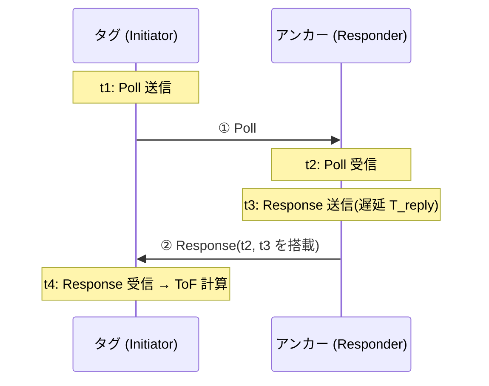

# SS-TWR 測距方式 詳細設計書

- 作成日: 2026-08-15
- ステータス: ドラフト(実装前レビュー用)
- 上位文書: [rtls-design.md](rtls-design.md) §2(**予備方式** — エアタイム逼迫時の代替)
- 関連文書: [ds-twr-design.md](ds-twr-design.md)(採用方式)、[tdoa-design.md](tdoa-design.md)(将来方式)

## 1. 位置づけ

SS-TWR(Single-Sided Two-Way Ranging)は 2 メッセージで完結する軽量な TWR。**標準方式は DS-TWR** とし、SS-TWR は次の条件で切り替える予備方式として設計しておく。

- タグ数・更新レートを上げて **UWB エアタイムが逼迫**した場合(交換時間 ≈ 2/3 に短縮)
- タグの電池持ちを優先し、送受信回数を減らしたい場合

**切替の前提条件(§4)を満たすことを実測で確認できるまで、本方式は投入しない。**

## 2. 測距原理

### 2.1 メッセージ交換(2 メッセージ方式)



### 2.2 ToF 計算式と本質的弱点

```
ToF = (T_round − T_reply) / 2        T_round = t4 − t1, T_reply = t3 − t2
```

タグとアンカーのクロック偏差差 Δe(= e_T − e_A)があると、T_reply の計測が両ノードで食い違い、誤差が**応答遅延に比例して**乗る:

```
err ≈ Δe × T_reply / 2
```

具体値: 各水晶 ±20 ppm(最悪 Δe = 40 ppm)、T_reply = 3000 µs のとき

```
err ≈ 40e-6 × 3000 µs / 2 = 60 ns  →  距離誤差 ≈ 18 m(!)
```

**つまり補償なしの SS-TWR は、本構成のようにホスト遅延で T_reply が ms 級になる場合、実用にならない。** 成立させるには次のいずれかが必須:

1. **クロックオフセット補償(CFO 補正)**: QM33120W は受信キャリアからクロック偏差比を推定できる(IEEE 802.15.4z 系デバイスの標準機能)。Response 受信時の偏差推定値で `T_reply` を補正すれば、残留誤差は cm〜dm 級に落ちる。**公式ライブラリの `requestRange()` が内部でこれを行うかは未確認 — 切替前提条件①として実測で検証する(§4)。**
2. **T_reply の最小化**: 補償が使えない場合、T_reply を µs 級(チップ内自動応答)まで詰める必要があるが、ホスト MCU 経由の本構成では現実的でない。

## 3. ライブラリ実装仕様

| 役割 | API | 備考 |
|---|---|---|
| タグ | `requestRange(M5Stamp_UWBRangeConfig)` → `M5Stamp_UWBRangeResult` | 公式サンプル `SS_TWR_TAG` 準拠 |
| アンカー | `respondRange(M5Stamp_UWBRangeConfig)` → `M5Stamp_UWBResponderResult` | `SS_TWR_ANCHOR` 準拠 |

- アドレス・PAN・PHY 設定、リトライ方針、TDMA 統合は **DS-TWR 設計(ds-twr-design.md §3.2, §3.4, §5)と同一**。タグの巡回ループで呼ぶ関数が `requestDSRange` → `requestRange` に変わるだけにする(`ranging.cpp` 内で方式をビルドフラグではなく**設定値**で切替可能にし、フィールドで A/B 比較できるようにする)。
- タイミング初期値: `response_delay` 3000 µs、RX タイムアウト 3000 µs(サンプル準拠)。

## 4. DS-TWR からの切替判断

| # | 前提条件(すべて実測で確認) | 検証方法 |
|---|---|---|
| ① | ライブラリの SS-TWR がクロックオフセット補償を行い、静的誤差が **σ ≤ 15 cm・バイアス ≤ 10 cm** に収まる | §6-1 の静的試験を DS-TWR と並べて実施 |
| ② | SS-TWR の 1 交換所要時間が DS-TWR 比で **30% 以上短い** | §6-2 タイミング実測 |
| ③ | 精度低下がシステム要件(CEP50 ≤ 30 cm)を壊さない | 同一ログ・リプレイで A案パイプラインの CEP を比較 |

判断基準の目安: **タグ×更新レートの積が「5 台 × 2 Hz」を超える拡張**(例: 5 台 × 4 Hz、10 台 × 2 Hz)を求められた時に検証を開始する。それ以下なら DS-TWR のまま。

## 5. エアタイム比較(切替の効果見積もり)

| 項目 | DS-TWR | SS-TWR | 備考 |
|---|---|---|---|
| メッセージ数/測距 | 3 | 2 | |
| 1 交換の所要時間 | ~T(実測、5〜10 ms 見込み) | ~0.6T | Final 送信と受信待ちが消える |
| スロット幅(4 アンカー+リトライ) | 90 ms | ~60 ms | スーパーフレーム 500 ms なら **8 タグ**まで、またはタグ 5 台のまま **~3 Hz** に向上 |
| タグ送信回数/測距 | 2 回 | 1 回 | 電池持ちに寄与 |

## 6. テスト計画

1. **静的精度(DS-TWR と対照)**: 既知距離 1 / 5 / 10 / 20 m で各 1000 回、DS-TWR と同条件で測距し、バイアス・σ・温度依存(始動直後 vs 30 分後)を比較。クロックオフセット補償の有無はここで判明する(補償なしなら m 級誤差が出る)。
2. **タイミング実測**: 1 交換の p50/p95 を計測し、§5 の短縮率を実測値に置き換える。
3. **方式切替試験**: 運用中に設定変更(`rtls/config/tuning` 経由)で DS→SS を切り替え、解算パイプライン(A案)が `bias_mm` 再校正だけで追従できることを確認(方式ごとにバイアスが異なる可能性があるため、**bias テーブルは方式別に持つ**)。
