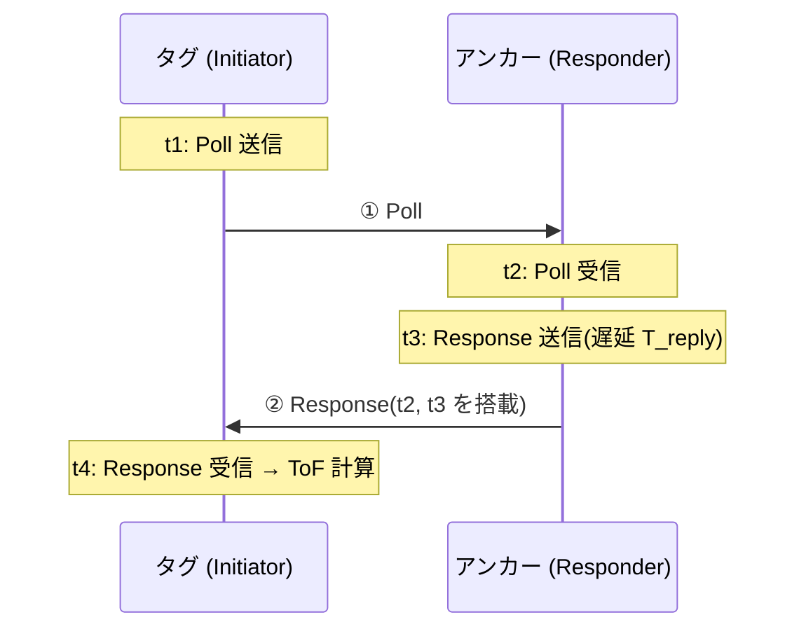

# SS-TWR測距方式詳細設計書

- 作成日: 2026-08-15
- ステータス: ドラフト(実装前レビュー用)
- 上位文書: [rtls-design.md](rtls-design.md) §2(**予備方式** — エアタイム逼迫時の代替)
- 関連文書: [ds-twr-design.md](ds-twr-design.md)(採用方式)、[tdoa-design.md](tdoa-design.md)(将来方式)

## 1. 位置づけ

SS-TWR(Single-Sided Two-Way Ranging)は2メッセージで完結する軽量なTWR。**標準方式はDS-TWR**とし、SS-TWRは次の条件で切り替える予備方式として設計しておく。

- タグ数・更新レートを上げて**UWBエアタイムが逼迫**した場合(交換時間 ≈ 2/3に短縮)
- タグの電池持ちを優先し、送受信回数を減らしたい場合

**切替の前提条件(§4)を満たすことを実測で確認できるまで、本方式は投入しない。**

## 2. 測距原理

### 2.1 メッセージ交換(2メッセージ方式)


```mermaid
sequenceDiagram
    participant T as タグ (Initiator)
    participant A as アンカー (Responder)
    Note over T: t1: Poll 送信
    T->>A: ① Poll
    Note over A: t2: Poll 受信
    Note over A: t3: Response 送信(遅延 T_reply)
    A->>T: ② Response(t2, t3 を搭載)
    Note over T: t4: Response 受信 → ToF 計算
```

### 2.2 ToF計算式と本質的弱点

```
ToF = (T_round − T_reply) / 2        T_round = t4 − t1, T_reply = t3 − t2
```

タグとアンカーのクロック偏差の差 Δe(= e_T − e_A)があると、T_replyの計測が両ノードで食い違い、誤差が**応答遅延に比例して**乗る:

```
err ≈ Δe × T_reply / 2
```

具体値: 各水晶 ±20 ppm(最悪 Δe = 40 ppm)、T_reply = 3000 µsのとき

```
err ≈ 40e-6 × 3000 µs / 2 = 60 ns  →  距離誤差 ≈ 18 m(!)
```

**つまり補償なしのSS-TWRは、本構成のようにホスト遅延でT_replyがms級になる場合、実用にならない。**成立させるには次のいずれかが必須:

1. **クロックオフセット補償(CFO補正)**: QM33120Wは受信キャリアからクロック偏差比を推定できる(IEEE 802.15.4z系デバイスの標準機能)。Response受信時の偏差推定値で`T_reply`を補正すれば、残留誤差はcm〜dm級に落ちる。**公式ライブラリの`requestRange()`が内部でこれを行うかは未確認 — 切替前提条件①として実測で検証する(§4)。**
2. **T_replyの最小化**: 補償が使えない場合、T_replyを µs級(チップ内自動応答)まで詰める必要があるが、ホストMCU経由の本構成では現実的でない。

## 3. ライブラリ実装仕様

| 役割 | API | 備考 |
|---|---|---|
| タグ | `requestRange(M5Stamp_UWBRangeConfig)` → `M5Stamp_UWBRangeResult` | 公式サンプル`SS_TWR_TAG`準拠 |
| アンカー | `respondRange(M5Stamp_UWBRangeConfig)` → `M5Stamp_UWBResponderResult` | `SS_TWR_ANCHOR`準拠 |

- アドレス・PAN・PHY設定、リトライ方針、TDMA統合は**DS-TWR設計(ds-twr-design.md §3.2, §3.4, §5)と同一**。タグの巡回ループで呼ぶ関数が`requestDSRange` → `requestRange`に変わるだけにする(`ranging.cpp`内で方式をビルドフラグではなく**設定値**で切替可能にし、フィールドでA/B比較できるようにする)。
- タイミング初期値: `responseTxDelayUus`(定数`kSsResponseTxDelayUus`)3000 µs、RXタイムアウト(`kSsRxTimeoutUus`)4500 µs(公式サンプル準拠。確定値は`rtls_common.h`の`kSs*`定数を正とする)。

## 4. DS-TWRからの切替判断

| # | 前提条件(すべて実測で確認) | 検証方法 |
|---|---|---|
| ① | ライブラリのSS-TWRがクロックオフセット補償を行い、静的誤差が**σ ≤ 15 cm・バイアス ≤ 10 cm**に収まる | §6の1. の静的試験をDS-TWRと並べて実施 |
| ② | SS-TWRの1交換所要時間がDS-TWR比で**30% 以上短い** | §6の2. タイミング実測 |
| ③ | 精度低下がシステム要件(CEP50 ≤ 30 cm)を壊さない | 同一ログ・リプレイでA案パイプラインのCEPを比較 |

判断基準の目安: **タグ×更新レートの積が「5台 × 2 Hz」を超える拡張**(例: 5台 × 4 Hz、10台 × 2 Hz)を求められた時に検証を開始する。それ以下ならDS-TWRのまま。

## 5. エアタイム比較(切替の効果見積もり)

| 項目 | DS-TWR | SS-TWR | 備考 |
|---|---|---|---|
| メッセージ数/測距 | 3 | 2 | |
| 1交換の所要時間 | ~T(実測、5〜10 ms見込み) | ~0.6T | Final送信と受信待ちが消える |
| スロット幅(4アンカー+リトライ) | 90 ms | ~60 ms | スーパーフレーム500 msなら**8タグ**まで、またはタグ5台のまま**~3 Hz**に向上 |
| タグ送信回数/測距 | 2回 | 1回 | 電池持ちに寄与 |

## 6. テスト計画

1. **静的精度(DS-TWRと対照)**: 既知距離1 / 5 / 10 / 20 mで各1000回、DS-TWRと同条件で測距し、バイアス・σ・温度依存(始動直後vs 30分後)を比較。クロックオフセット補償の有無はここで判明する(補償なしならm級誤差が出る)。
2. **タイミング実測**: 1交換のp50/p95を計測し、§5の短縮率を実測値に置き換える。
3. **方式切替試験**: 運用中に設定変更(`rtls/config/tuning`経由)でDS→SSを切り替え、解算パイプライン(A案)が`bias_mm`再校正だけで追従できることを確認(方式ごとにバイアスが異なる可能性があるため、**biasテーブルは方式別に持つ**)。
