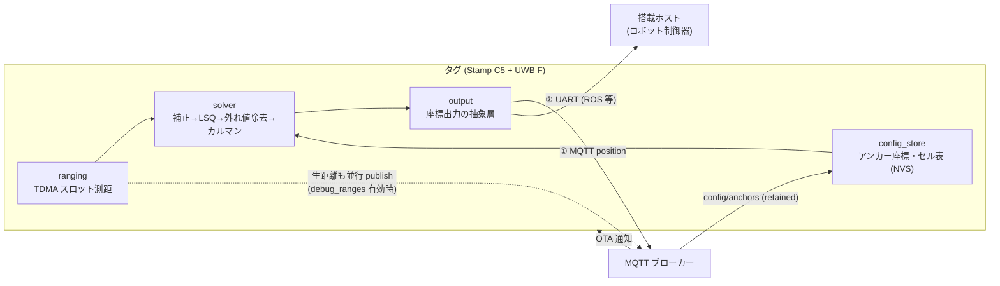
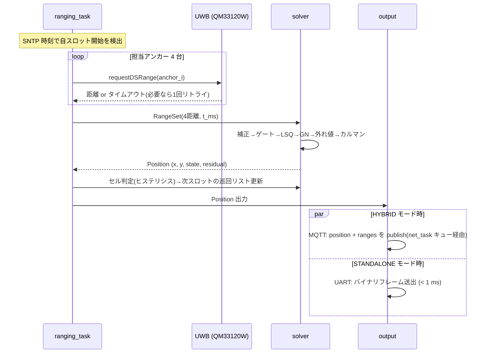

# タグ上測位 詳細設計書(B案: タグ上計算)

- 作成日: 2026-08-15
- ステータス: ドラフト(実装前レビュー用)
- 上位文書: [rtls-design.md](rtls-design.md)(基本設計 §5 の「B案: タグ上計算」の詳細設計)
- 姉妹文書: [server-design.md](server-design.md)(A案。解算アルゴリズムは本書と共通仕様)

## 1. スコープと位置づけ

本書は、**タグ(ESP32-C5)上で測距から座標解算までを完結**させる構成の詳細設計を定める。基本設計 §5 の比較で標準構成は A案(サーバー計算)としたため、B案は次の用途を主対象とする。

| 想定用途 | 説明 |
|---|---|
| **自律移動体搭載** | ロボット・AGV がタグを搭載し、自己位置を低レイテンシで直接利用する(サーバー往復 +20〜100 ms を排除) |
| サーバーレス運用 | 可視化・記録が不要で、座標を外部システム(ROS 等)へ直接渡すだけの構成 |
| ネットワーク断耐性 | Wi-Fi が不安定な環境でも測位自体は継続する必要がある場合 |

**設計方針: A案と同一の解算仕様(§4)を C++ に移植し、A案の弱点(デバッグ性・チューニング性)を「生距離の並行送信」と「OTA 更新」で緩和する。** 解算アルゴリズムの仕様は server-design.md §5 を正とし、本書では ESP32 実装に固有の差分のみ規定する。

## 2. システム構成と動作モード



| モード | 出力 | 用途 |
|---|---|---|
| `HYBRID`(既定) | MQTT へ position **と生距離の両方**を publish | 開発・チューニング期。サーバー側リプレイ(A案 §8)をそのまま使える |
| `STANDALONE` | UART(または UDP ユニキャスト)へ position のみ | ロボット搭載。Wi-Fi なしでも測位継続 |
| `QUIET` | MQTT へ position のみ | 帯域・電力を絞る本番運用 |

モードは NVS 設定で切替(ビルド不要)。**HYBRID を既定とし、B案の最大の弱点「座標しか見えず誤差原因を追えない」を運用で回避する。**

## 3. ファームウェア構成(PlatformIO)

```
firmware/tag/
├── platformio.ini           # env:tag (esp32-c5) / env:native (ホストテスト用)
├── src/
│   ├── main.cpp             # 起動・タスク生成
│   ├── ranging.cpp/.h       # TDMA スロット管理・アンカー巡回測距
│   ├── net.cpp/.h           # Wi-Fi / SNTP / MQTT / OTA
│   ├── config_store.cpp/.h  # NVS 永続化と config/anchors 受信反映
│   └── output.cpp/.h        # position の出力先抽象化 (MQTT/UART/UDP)
├── lib/rtls_solver/         # ★解算ライブラリ(ハード非依存・ヘッダオンリー)
│   ├── geometry.hpp         # 高低差補正・線形化LSQ・Gauss-Newton
│   ├── outlier.hpp          # ゲーティング・leave-one-out
│   ├── kalman.hpp           # CV モデル 2D カルマン (4状態、固定サイズ行列)
│   └── pipeline.hpp         # §4 のパイプライン統合
└── test/                    # env:native で動く solver 単体テスト
```

**`rtls_solver` は Arduino API に依存させない**(素の C++17、`float` 固定サイズ配列のみ)。これにより:

- PlatformIO の `env:native` でホスト PC 上の単体テストが回る(実機不要)
- A案のシミュレータ出力(ranges JSONL)をホストで流し込み、**Python 実装との解算結果一致試験**ができる(§8)

### FreeRTOS タスク構成

| タスク | 優先度 | 周期/契機 | 役割 |
|---|---|---|---|
| `ranging_task` | 高 | TDMA スロット到来 | アンカー巡回 DS-TWR → RangeSet 生成 → solver 呼出し → output へ渡す |
| `net_task` | 中 | イベント駆動 | MQTT 送受信、SNTP 再同期(**5 分毎・スルー補正+ドリフト率補正**、rtls-design.md §4.9)、OTA 受付 |
| `monitor_task` | 低 | 1 s | ヒープ・測距成功率・スロットずれの統計、LED 表示 |

solver は `ranging_task` 内で同期実行する(実測目標 < 5 ms、§7)。キュー渡しにしないことでスロット内で解算まで完結し、座標のタイムスタンプが単純になる。

## 4. 解算パイプライン(C++ 移植仕様)

処理段構成・パラメータ・状態機械(INIT/TRACKING/COASTING/STALE/LOST)は **server-design.md §5 と同一**。ESP32 実装での差分のみ示す。

| 段 | A案 (Python) | B案 (C++) の実装 |
|---|---|---|
| ① 検証 | pydantic | 不要(自プロセス内で RangeSet を生成するため。ok フラグ確認のみ) |
| ② 高低差補正 | 同一式 | 同一式(`sqrtf`) |
| ③ ゲーティング | 同一 | 同一 |
| ④ 線形化 LSQ | `numpy.linalg.lstsq` | 正規方程式 `AᵀA x = Aᵀb` を **2×2 の手解き**(逆行列公式)。条件数チェック(det が小さい=共線配置なら解算失敗扱い) |
| ⑤ リファイン | `scipy.least_squares` (soft_l1) | **Gauss-Newton 最大 5 反復** + Huber 重み(δ=0.3 m)。2×2 正規方程式の反復なので軽量。発散(ステップ > 1 m)時は線形解を採用 |
| ⑥ 外れ値除去 | 最悪 1 距離除外・1 回 | 同一 |
| ⑦ カルマン | numpy | 4×4 固定サイズ行列をベタ書き(行列ライブラリ不使用)。`float` で十分(座標 50 m / 分解能 cm) |

**数値仕様**: 全計算 `float`(単精度)。距離二乗の桁(最大 55² ≈ 3000)でも float の 7 桁精度で cm 分解能を維持できるが、線形化 LSQ の右辺 `(x_i²−x_1²)` 等は**座標をフロア中心原点に平行移動してから計算**し桁落ちを防ぐ。

## 5. アンカー座標・セル表の配布(config_store)

B案固有の課題: A案ではサーバーだけが持っていたアンカー座標・セル定義を**全タグが持つ**必要がある。

- サーバー(または管理 PC の配布スクリプト)が `rtls/config/anchors` に **retained + version 付き**で全体設定を publish する:

```json
{"version": 3,
 "tag_height_m": 1.0,
 "anchors": {"0x0010": {"x": 0.0, "y": 0.0, "z": 2.2, "bias_mm": -35}, "...": {}},
 "cells":   {"A": {"rect": [0,0,25,25], "anchors": ["0x0010","0x0011","0x0013","0x0014"]}}}
```

- タグは起動時と受信時に version を比較し、新しければ **NVS に保存して即反映**。以後は Wi-Fi 断でも NVS の設定で動作継続(STANDALONE モードの前提)。
- 12 アンカー + 8 セルで JSON 約 2 KB、NVS 使用量は問題にならない。パース失敗時は旧設定を維持。
- **セル判定・ハンドオーバーはタグ自身が実行**(アルゴリズムは server-design.md §6 と同一のヒステリシス)。サーバーからのアンカーリスト配信(`rtls/tag/{id}/anchors`)は不要になり、A案とのトピック互換のため受信しても無視する。

## 6. TDMA スロット内の処理シーケンス

基本設計 §4.4 のスーパーフレーム(500 ms、スロット 90 ms)の中で解算まで行う。



### スロット内時間予算(90 ms、実測で確定させる)

| 処理 | 予算 |
|---|---|
| DS-TWR × 4(リトライ 1 回込み) | ~60 ms(1 回 5〜10 ms 想定 — 基本設計ロードマップ Step 1 で実測) |
| 解算(§4 パイプライン) | < 5 ms(目標。240 MHz で数十 µs オーダーの見込み) |
| 出力(UART 即時 / MQTT はキュー投入のみ) | < 1 ms |
| ガード余裕 | 残り ~25 ms |

MQTT の実送信は `net_task` が非同期に行い、**スロット時間を Wi-Fi の遅延で食わない**。

## 7. UART 出力仕様(STANDALONE / ロボット搭載向け)

115200 bps、バイナリフレーム(リトルエンディアン):

| オフセット | 型 | 内容 |
|---|---|---|
| 0 | uint8×2 | ヘッダ `0xB5 0x50` |
| 2 | uint8 | tag_id |
| 3 | uint8 | state (0=INIT,1=TRACKING,2=COASTING,3=STALE,4=LOST) |
| 4 | uint32 | t_ms(SNTP 同期時刻の下位 32bit) |
| 8 | float×4 | x_m, y_m, vx_ms, vy_ms |
| 24 | float | residual_m |
| 28 | uint8 | n_used |
| 29 | uint8 | checksum(0〜28 の XOR) |

30 バイト固定。2 Hz なら帯域は無視できる。ROS 側はシリアルノードでこのフレームを `PoseWithCovarianceStamped` に変換する想定(residual から共分散を組み立てる)。

## 8. チューニング・デバッグ戦略(B案の弱点への対策)

| A案に劣る点 | 本設計での緩和策 |
|---|---|
| アルゴリズム変更のたびに書き込みが必要 | **OTA 更新**(`esp_https_ota`、`net_task` が MQTT の更新通知で起動)。全タグへ一括配信 |
| 誤差原因(どの距離が狂ったか)を追えない | **HYBRID モード**で生距離を並行 publish → A案の recorder/replay がそのまま使える |
| パラメータ試行錯誤が遅い | `tuning` パラメータ(gate、residual_gate、σ 類)を **NVS + MQTT `rtls/config/tuning`(retained, version 付き)** で配布し、書き込み不要で変更 |
| 解算実装が Python と乖離するリスク | `rtls_solver` を `env:native` でビルドし、**同一 ranges 入力に対する Python 実装との一致試験**(許容差 1 cm)を CI 的に実行 |

## 9. リソース見積もり

| 項目 | 見積もり | 備考 |
|---|---|---|
| solver コード + 状態 | < 10 KB RAM | 4×4 行列 float 数個 + 履歴なし |
| config(12 アンカー + セル表) | ~4 KB RAM / ~2 KB NVS | |
| Wi-Fi + MQTT + TLS なし | ~50 KB RAM | ESP32 標準スタック |
| 合計 | 384 KB SRAM に対し余裕 | PSRAM 不要 |
| 解算 CPU 時間 | 数十 µs〜1 ms /エポック | 240 MHz、FPU あり |
| 消費電力への影響 | 解算分は無視できる(支配項は UWB 測距と Wi-Fi) | 基本設計 §7 のタグ電池リスクと同じ |

## 10. テスト計画

1. **ホスト単体テスト(`env:native`、実機不要)**: server-design.md §13 の 1. と同一ケース(合成ジオメトリ、NLoS 注入、軌跡追従、縮退配置)を C++ 側でも実行。
2. **Python 一致試験**: A案シミュレータの ranges JSONL をホストビルドの solver に入力し、Python 実装の positions と突き合わせる。許容差: **中央値 ≤ 1 cm・p99 ≤ 2 cm・最大 ≤ 10 cm**(外れ値除去が発火するエポックは scipy soft_l1 と IRLS Gauss-Newton の反復差が cm 級で現れるため。実測: 中央値 0.0 mm / p99 0.34 mm / 最大 16.9 mm、状態一致 100%)。**以後、アルゴリズム変更は必ず両実装同時に行う**ことをルール化。
3. **実機タイミング試験**: スロット内の各処理時間(測距×4、解算、出力)を `esp_timer` で計測し、§6 の時間予算表を実測値で更新。90 ms に収まらない場合はリトライ回数かアンカー数を調整。
4. **断線試験**: Wi-Fi AP 停止 → STANDALONE 動作(UART 出力継続)→ 復帰後の MQTT 再接続と config version 追従を確認。
5. **受入基準**: A案と同一(CEP50 ≤ 0.30 m 等)+ UART 出力レイテンシ(測距完了→フレーム送出)p95 < 10 ms。

## 11. A案との使い分け・移行

- **開発は常に A案の環境(シミュレータ・リプレイ・可視化)で先行**し、確定したアルゴリズム・パラメータを B案へ移植する流れとする(§8 の一致試験が橋渡し)。
- タグ FW は A案構成でも B案構成でも**測距・TDMA 部分(`ranging.cpp`)は共通**。差分は「solver を積むか」「何を publish するか」のみで、ビルドフラグ `-DENABLE_ONBOARD_SOLVER` で切り替える。
- 運用上の推奨: 人・資産の追跡は A案、ロボット搭載タグのみ B案(HYBRID モード)、という**混在構成**が可能。B案タグの生距離もサーバーに届くため、フロア全体の監視・記録は A案側に一元化できる。

## 12. 実装順序

1. `rtls_solver`(ヘッダオンリー)+ `env:native` 単体テスト — A案 §15 の 2. の Python 実装と並走
2. Python 一致試験(§10 の 2.)の整備
3. `ranging.cpp` の TDMA 化(基本設計 Step 3 と共通作業)
4. `config_store` + `rtls/config/#` 配布フロー
5. `output`(MQTT HYBRID → UART)+ 実機タイミング試験
6. OTA・`rtls/config/tuning` 反映 — 運用開始後のチューニングループ確立
