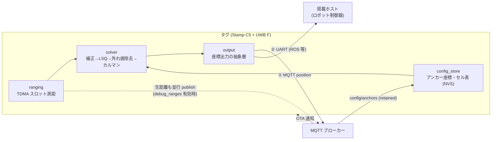
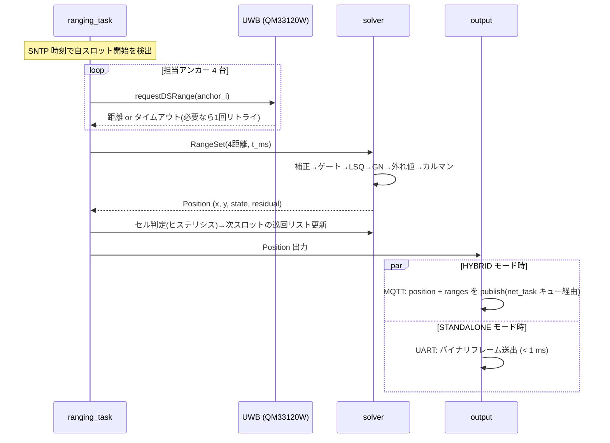

# タグ上測位詳細設計書(B案: タグ上計算)

- 作成日: 2026-08-15
- ステータス: ドラフト(実装前レビュー用)
- 上位文書: [rtls-design.md](rtls-design.md)(基本設計 §5の「B案: タグ上計算」の詳細設計)
- 関連文書: [server-design.md](server-design.md)(A案。解算アルゴリズムは本書と共通仕様)

## 1. スコープと位置づけ

本書は、**タグ(ESP32-C5)上で測距から座標解算までを完結**させる構成の詳細設計を定める。基本設計 §5の比較で標準構成はA案(サーバー計算)としたため、B案は次の用途を主対象とする。

| 想定用途 | 説明 |
|---|---|
| **自律移動体搭載** | ロボット・AGVがタグを搭載し、自己位置を低レイテンシで直接利用する(サーバー往復 +20〜100 msを排除) |
| サーバーレス運用 | 可視化・記録が不要で、座標を外部システム(ROS等)へ直接渡すだけの構成 |
| ネットワーク断耐性 | Wi-Fiが不安定な環境でも測位自体は継続する必要がある場合 |

**設計方針: A案と同一の解算仕様(§4)をC++ に移植し、A案に劣る点(デバッグ性・チューニング性)を「生距離の並行送信」と「OTA更新」で緩和する。**解算アルゴリズムの仕様はserver-design.md §5を正とし、本書ではESP32実装に固有の差分のみ規定する。

## 2. システム構成と動作モード


```mermaid
flowchart LR
    subgraph tag["タグ (Stamp C5 + UWB F)"]
        RNG["ranging<br/>TDMA スロット測距"]
        SOL["solver<br/>補正→LSQ→外れ値除去→カルマン"]
        CFG["config_store<br/>アンカー座標・セル表 (NVS)"]
        OUT["output<br/>座標出力の抽象層"]
        RNG --> SOL
        CFG --> SOL
        SOL --> OUT
    end
    OUT -- "① MQTT position" --> BR["MQTT ブローカー"]
    OUT -- "② UART (ROS 等)" --> HOST["搭載ホスト<br/>(ロボット制御器)"]
    RNG -. "生距離も並行 publish<br/>(debug_ranges 有効時)" .-> BR
    BR -- "config/anchors (retained)" --> CFG
    BR -- "OTA 通知" --> tag
```

| モード | 出力 | 用途 |
|---|---|---|
| `HYBRID`(既定) | MQTTへposition **と生距離の両方**をpublish | 開発・チューニング期。サーバー側リプレイ(A案 §8)をそのまま使える |
| `STANDALONE` | UART(またはUDPユニキャスト)へpositionのみ | ロボット搭載。Wi-Fiなしでも測位継続 |
| `QUIET` | MQTTへpositionのみ | 帯域・電力を絞る本番運用 |

モードはNVS設定で切替(ビルド不要)。**HYBRIDを既定とし、B案の最大の弱点「座標しか見えず誤差原因を追えない」を運用で回避する。**

## 3. ファームウェア構成(PlatformIO)

```
firmware/tag/
├── platformio.ini           # env:tag (esp32-c5) / env:native (ホストテスト用)
├── src/
│   ├── main.cpp             # 起動・タスク生成
│   ├── ranging.cpp/.h       # TDMA スロット管理・アンカー巡回測距
│   ├── net.cpp/.h           # Wi-Fi / SNTP / MQTT / OTA
│   ├── config_store.cpp/.h  # NVS 永続化と config/anchors 受信反映
│   └── output.cpp/.h        # position の出力先抽象化 (MQTT/UART/UDP)
├── lib/rtls_solver/         # ★解算ライブラリ(ハード非依存・ヘッダオンリー)
│   ├── geometry.hpp         # 高低差補正・線形化LSQ・Gauss-Newton
│   ├── outlier.hpp          # ゲーティング・leave-one-out
│   ├── kalman.hpp           # CV モデル 2D カルマン (4状態、固定サイズ行列)
│   └── pipeline.hpp         # §4 のパイプライン統合
└── test/                    # env:native で動く solver 単体テスト
```

**`rtls_solver`はArduino APIに依存させない**(素のC++17、`float`固定サイズ配列のみ)。これにより:

- PlatformIOの`env:native`でホストPC上の単体テストが回る(実機不要)
- A案のシミュレータ出力(ranges JSONL)をホストで流し込み、**Python実装との解算結果一致試験**ができる(§8)

### FreeRTOSタスク構成

| タスク | 優先度 | 周期/契機 | 役割 |
|---|---|---|---|
| `ranging_task` | 高 | TDMAスロット到来 | アンカー巡回DS-TWR → RangeSet生成 → solver呼出し → outputへ渡す |
| `net_task` | 中 | イベント駆動 | MQTT送受信、SNTP再同期(**5分毎・スルー補正+ドリフト率補正**、rtls-design.md §4.9)、OTA受付 |
| `monitor_task` | 低 | 1 s | ヒープ・測距成功率・スロットずれの統計、LED表示 |

solverは`ranging_task`内で同期実行する(実測目標 < 5 ms、§7)。キュー渡しにしないことでスロット内で解算まで完結し、座標のタイムスタンプが単純になる。

## 4. 解算パイプライン(C++ 移植仕様)

処理段構成・パラメータ・状態機械(INIT/TRACKING/COASTING/STALE/LOST)は**server-design.md §5と同一**。ESP32実装での差分のみ示す。

| 段 | A案(Python) | B案(C++)の実装 |
|---|---|---|
| ① 検証 | pydantic | 不要(自プロセス内でRangeSetを生成するため。okフラグ確認のみ) |
| ② 高低差補正 | 同一式 | 同一式(`sqrtf`) |
| ③ ゲーティング | 同一 | 同一 |
| ④ 線形化LSQ | `numpy.linalg.lstsq` | 正規方程式`AᵀA x = Aᵀb`を**2×2の手解き**(逆行列公式)。条件数チェック(detが小さい=共線配置なら解算失敗扱い) |
| ⑤ リファイン | `scipy.least_squares` (soft_l1) | **Gauss-Newton最大5反復** + Huber重み(δ=0.3 m)。2×2正規方程式の反復なので軽量。発散(ステップ > 1 m)時は線形解を採用 |
| ⑥ 外れ値除去 | 最悪1距離除外・1回 | 同一 |
| ⑦ カルマン | numpy | 4×4固定サイズ行列をベタ書き(行列ライブラリ不使用)。`float`で十分(座標50 m / 分解能cm) |

**数値仕様**: 全計算`float`(単精度)。距離二乗の桁(最大55² ≈ 3000)でもfloatの7桁精度でcm分解能を維持できるが、線形化LSQの右辺`(x_i²−x_1²)`等は**座標をフロア中心原点に平行移動してから計算**し桁落ちを防ぐ。

## 5. アンカー座標・セル表の配布(config_store)

B案固有の課題: A案ではサーバーだけが持っていたアンカー座標・セル定義を**全タグが持つ**必要がある。

- サーバー(または管理PCの配布スクリプト)が`rtls/config/anchors`に**retained + version付き**で全体設定をpublishする:

```json
{"version": 3,
 "tag_height_m": 1.0,
 "anchors": {"0x0010": {"x": 0.0, "y": 0.0, "z": 2.2, "bias_mm": -35}, "...": {}},
 "cells":   {"A": {"rect": [0,0,25,25], "anchors": ["0x0010","0x0011","0x0013","0x0014"]}}}
```

- タグは起動時と受信時にversionを比較し、新しければ**NVSに保存して即反映**。以後はWi-Fi断でもNVSの設定で動作継続(STANDALONEモードの前提)。
- 12アンカー + 8セルでJSON約2 KB、NVS使用量は問題にならない。パース失敗時は旧設定を維持。
- **セル判定・ハンドオーバーはタグ自身が実行**(アルゴリズムはserver-design.md §6と同一のヒステリシス)。サーバーからのアンカーリスト配信(`rtls/tag/{id}/anchors`)は不要になり、A案とのトピック互換のため受信しても無視する。

## 6. TDMAスロット内の処理シーケンス

基本設計 §4.4のスーパーフレーム(500 ms、スロット90 ms)の中で解算まで行う。


```mermaid
sequenceDiagram
    participant S as ranging_task
    participant U as UWB (QM33120W)
    participant K as solver
    participant O as output
    Note over S: SNTP 時刻で自スロット開始を検出
    loop 担当アンカー 4 台
        S->>U: requestDSRange(anchor_i)
        U-->>S: 距離 or タイムアウト(必要なら1回リトライ)
    end
    S->>K: RangeSet(4距離, t_ms)
    K->>K: 補正→ゲート→LSQ→GN→外れ値→カルマン
    K-->>S: Position (x, y, state, residual)
    S->>K: セル判定(ヒステリシス)→次スロットの巡回リスト更新
    S->>O: Position 出力
    par HYBRID モード時
        O->>O: MQTT: position + ranges を publish(net_task キュー経由)
    and STANDALONE モード時
        O->>O: UART: バイナリフレーム送出 (< 1 ms)
    end
```

### スロット内時間予算(90 ms、実測で確定させる)

| 処理 | 予算 |
|---|---|
| DS-TWR × 4(リトライ1回込み) | ~60 ms(1回5〜10 ms想定 — 基本設計ロードマップStep 1で実測) |
| 解算(§4パイプライン) | < 5 ms(目標。240 MHzで数十 µsオーダーの見込み) |
| 出力(UART即時 / MQTTはキュー投入のみ) | < 1 ms |
| ガード余裕 | 残り ~25 ms |

MQTTの実送信は`net_task`が非同期に行い、**スロット時間をWi-Fiの遅延で食わない**。

## 7. UART出力仕様(STANDALONE / ロボット搭載向け)

115200 bps、バイナリフレーム(リトルエンディアン):

| オフセット | 型 | 内容 |
|---|---|---|
| 0 | uint8×2 | ヘッダ`0xB5 0x50` |
| 2 | uint8 | tag_id |
| 3 | uint8 | state (0=INIT,1=TRACKING,2=COASTING,3=STALE,4=LOST) |
| 4 | uint32 | t_ms(SNTP同期時刻の下位32bit) |
| 8 | float×4 | x_m, y_m, vx_ms, vy_ms |
| 24 | float | residual_m |
| 28 | uint8 | n_used |
| 29 | uint8 | checksum(0〜28のXOR) |

30バイト固定。2 Hzなら帯域は無視できる。ROS側はシリアルノードでこのフレームを`PoseWithCovarianceStamped`に変換する想定(residualから共分散を組み立てる)。

## 8. チューニング・デバッグ戦略(B案の弱点への対策)

| A案に劣る点 | 本設計での緩和策 |
|---|---|
| アルゴリズム変更のたびに書き込みが必要 | **OTA更新**(`esp_https_ota`、`net_task`がMQTTの更新通知で起動)。全タグへ一括配信 |
| 誤差原因(どの距離が狂ったか)を追えない | **HYBRIDモード**で生距離を並行publish → A案のrecorder/replayがそのまま使える |
| パラメータ試行錯誤が遅い | `tuning`パラメータ(gate、residual_gate、σ 類)を**NVS + MQTT `rtls/config/tuning`(retained, version付き)**で配布し、書き込み不要で変更 |
| 解算実装がPythonと乖離するリスク | `rtls_solver`を`env:native`でビルドし、**同一ranges入力に対するPython実装との一致試験**(許容差1 cm)をCI的に実行 |

## 9. リソース見積もり

| 項目 | 見積もり | 備考 |
|---|---|---|
| solverコード + 状態 | < 10 KB RAM | 4×4行列float数個 + 履歴なし |
| config(12アンカー + セル表) | ~4 KB RAM / ~2 KB NVS | |
| Wi-Fi + MQTT + TLSなし | ~50 KB RAM | ESP32標準スタック |
| 合計 | 384 KB SRAMに対し余裕 | PSRAM不要 |
| 解算CPU時間 | 数十 µs〜1 ms /エポック | 240 MHz、FPUあり |
| 消費電力への影響 | 解算分は無視できる(支配項はUWB測距とWi-Fi) | 基本設計 §7のタグ電池リスクと同じ |

## 10. テスト計画

1. **ホスト単体テスト(`env:native`、実機不要)**: server-design.md §13の1. と同一ケース(合成ジオメトリ、NLoS注入、軌跡追従、縮退配置)をC++ 側でも実行。
2. **Python一致試験**: A案シミュレータのranges JSONLをホストビルドのsolverに入力し、Python実装のpositionsと突き合わせる。許容差: **中央値 ≤ 1 cm・p99 ≤ 2 cm・最大 ≤ 10 cm**(外れ値除去が発火するエポックはscipy soft_l1とIRLS Gauss-Newtonの反復差がcm級で現れるため。実測: 中央値0.0 mm / p99 0.34 mm / 最大16.9 mm、状態一致100%)。**以後、アルゴリズム変更は必ず両実装同時に行う**ことをルール化。
3. **実機タイミング試験**: スロット内の各処理時間(測距×4、解算、出力)を`esp_timer`で計測し、§6の時間予算表を実測値で更新。90 msに収まらない場合はリトライ回数かアンカー数を調整。
4. **断線試験**: Wi-Fi AP停止 → STANDALONE動作(UART出力継続)→ 復帰後のMQTT再接続とconfig version追従を確認。
5. **受入基準**: A案と同一(CEP50 ≤ 0.30 m等)+ UART出力レイテンシ(測距完了→フレーム送出)p95 < 10 ms。

## 11. A案との使い分け・移行

- **開発は常にA案の環境(シミュレータ・リプレイ・可視化)で先行**し、確定したアルゴリズム・パラメータをB案へ移植する流れとする(§8の一致試験が橋渡し)。
- タグFWはA案構成でもB案構成でも**測距・TDMA部分(`ranging.cpp`)は共通**。差分は「solverを積むか」「何をpublishするか」のみで、ビルドフラグ`-DENABLE_ONBOARD_SOLVER`で切り替える。
- 運用上の推奨: 人・資産の追跡はA案、ロボット搭載タグのみB案(HYBRIDモード)、という**混在構成**が可能。B案タグの生距離もサーバーに届くため、フロア全体の監視・記録はA案側に一元化できる。

## 12. 実装順序

1. `rtls_solver`(ヘッダオンリー)+ `env:native`単体テスト — A案 §15の2. のPython実装と並走
2. Python一致試験(§10の2.)の整備
3. `ranging.cpp`のTDMA化(基本設計Step 3と共通作業)
4. `config_store` + `rtls/config/#`配布フロー
5. `output`(MQTT HYBRID → UART)+ 実機タイミング試験
6. OTA・`rtls/config/tuning`反映 — 運用開始後のチューニングループ確立
