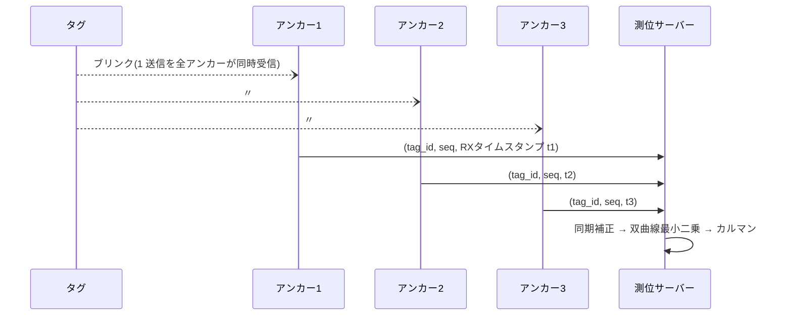

# TDoA測位方式詳細設計書(将来方式)

- 作成日: 2026-08-15
- ステータス: ドラフト(**実現条件の設計** — 現行システムでは不採用)
- 上位文書: [rtls-design.md](rtls-design.md) §2(不採用理由)・§7(エアタイム逼迫リスク)
- 関連文書: [ds-twr-design.md](ds-twr-design.md)、[ss-twr-design.md](ss-twr-design.md)

## 1. 位置づけ

TDoA(Time Difference of Arrival)は基本設計 §2で**不採用**とした方式。本書は「不採用の根拠を技術的に固定する」ことと、「将来TWRの容量限界(タグ10台超・高更新レート・電池数年級)を超える要求が出た場合に、何を作れば実現できるか」を設計として残すことを目的とする。**実装の意思決定文書ではない。**

## 2. 測位原理

### 2.1 ブリンクと到達時刻差

タグは**1回の短いブリンク送信のみ**を行い、複数アンカーが受信時刻(RXタイムスタンプ)を記録する。アンカーi, jの受信時刻差から

```
c × (t_i − t_j) = ‖p − a_i‖ − ‖p − a_j‖
```

という**双曲線**が得られ、アンカー4台以上(2Dなら独立差3本)の交点としてタグ位置pを解く。


```mermaid
sequenceDiagram
    participant T as タグ
    participant A1 as アンカー1
    participant A2 as アンカー2
    participant A3 as アンカー3
    participant S as 測位サーバー
    T--)A1: ブリンク(1 送信を全アンカーが同時受信)
    T--)A2: 〃
    T--)A3: 〃
    A1->>S: (tag_id, seq, RXタイムスタンプ t1)
    A2->>S: (tag_id, seq, t2)
    A3->>S: (tag_id, seq, t3)
    S->>S: 同期補正 → 双曲線最小二乗 → カルマン
```

### 2.2 TWRとの本質的トレードオフ

| 観点 | TWR(現行) | TDoA |
|---|---|---|
| タグの送受信/測位 | 送2×4 + 受2×4(DS、4アンカー) | **送1・受0** |
| タグ電力 | mA級デューティ | µA級平均(電池が年単位) |
| 容量 | エアタイムで数十測位/秒 | ブリンク < 1 ms → **数百タグ**でも成立(ALOHA) |
| アンカー要件 | 応答するだけ(同期不要) | **ns級クロック同期 + 常時受信 + バックホール必須** |
| タグ側の複雑さ | 巡回・TDMAが必要 | ブリンクするだけ(乱数間隔) |
| 難しさの所在 | タグ側の規律 | **アンカー側のインフラ** |

要するにTDoAは「タグを極限まで単純・省電力にする代わりに、アンカーを高機能なインフラにする」方式。1 nsの同期誤差 = 30 cmの測位誤差なので、**アンカー間同期を ~1 nsに保つ仕組みが成立条件のすべて**である。

## 3. 成立条件(何を作れば実現できるか)

### 3.1 前提条件: RXタイムスタンプへのアクセス ★最大の障壁

公式ライブラリの公開API(`receiveFrame()`等)は**受信フレームのns級RXタイムスタンプを公開していない**。DW3720のレジスタ(RX_STAMP相当)には存在するため、同梱の`qm33120w_sdk`を直接叩く**ライブラリ拡張の自作**が必要になる。これが成立しない限りTDoAは始まらない — 着手時は最初にこの拡張のPoCを行う(§6)。

### 3.2 アンカー間クロック同期の方式比較

| 方式 | 精度 | 判定 | 内容 |
|---|---|---|---|
| **無線同期(リファレンスアンカー方式)** | ~1 ns級(文献実績) | ✅ 採用候補 | マスターアンカーが既知位置から周期ブリンク(例: 100 ms毎)を送信。各アンカーは「マスターブリンクの受信時刻」と「既知の伝搬遅延」から自クロックのオフセット+ドリフト率を推定し、タグブリンクのRX時刻を共通時間軸へ補正する。追加ハード不要 |
| 有線クロック分配 | < 1 ns | △ | 全アンカーへ同軸/ツイストペアでクロック配線。精度は最良だが配線工事がセル分割の利点を消す |
| Wi-Fi/NTP系 | ms〜µs | ❌ | 6桁足りない(1 ms = 300 km) |

**無線同期の設計骨子**: アンカー時計の状態(offset, drift)をアンカーごとにサーバー側で2状態カルマン推定する。マスターブリンク間隔100 ms・水晶 ±20 ppmのとき、区間中のドリフト誤差は20e-6 × 100 ms = 2 µs — これを**ドリフト率推定で補正**して残留 ~1 nsに抑えるのが成立ラインであり、水晶の短期安定度(温度変動)が実質的な精度上限を決める。TCXO搭載アンカーへの置換が必要になる可能性がある(実測で判断)。

### 3.3 システム構成(実現時)

```mermaid
flowchart TB
    subgraph floor["フロア"]
        TAG["タグ ×N<br/>乱数間隔ブリンクのみ<br/>(Wi-Fi 不要・µA 級)"]
        M["マスターアンカー<br/>周期同期ブリンク"]
        A["アンカー ×8〜12<br/>常時受信 + RX タイムスタンプ取得<br/>★拡張ライブラリ"]
    end
    TAG --)A: ブリンク
    M --)A: 同期ブリンク (100 ms 毎)
    A -- "有線 LAN 推奨<br/>(t_rx, tag_id, seq)" --> S["測位サーバー"]
    S --> SYNC["クロック補正<br/>(アンカー別 offset/drift カルマン)"]
    SYNC --> SOLVE["双曲線最小二乗<br/>(Chan 初期解 + Taylor 反復)"]
    SOLVE --> KF["タグ別カルマン<br/>(A案 §5 を流用)"]
```

現行構成からの主な変更点:

| 要素 | 現行(TWR) | TDoA化での変更 |
|---|---|---|
| タグFW | 巡回測距 + TDMA + Wi-Fi | **ブリンクのみ**(乱数間隔 = スロットレスALOHA。衝突は確率損失として許容) |
| アンカーFW | `respondDSRange()`ループ | 常時RX + タイムスタンプ即時報告。**Wi-Fiでは報告遅延ジッタが大きく、有線LAN(またはイーサネット付きホストへの換装)を推奨** |
| サーバー | 距離 → 三辺測量 | 受信時刻 → 同期補正 → 双曲線解算。カルマン以降(A案 §5 ⑦)は流用可 |
| 校正 | ノード別bias | アンカー別RX遅延校正 + マスター・各アンカー間の正確な測量(同期精度に直結) |

### 3.4 解算(サーバー側)

- 観測: 基準アンカー0との時刻差`Δt_i = t_i − t_0`(同期補正後)。
- 初期解: Chanの閉形式解、以後Taylor展開の反復最小二乗(残差 = 双曲線距離差)。幾何条件が悪い(アンカー凸包の外)と発散しやすいため、**セル内(凸包内)のみで解算**する制約はTWRと同じ。
- 外れ値・平滑化: A案 §5のゲーティング・leave-one-out・カルマンをそのまま適用(観測モデルだけ差し替え)。

## 4. 誤差予算(成立時の見込み)

| 要因 | 目安 | 備考 |
|---|---|---|
| 同期残留誤差 | 30 cm/ns → **~1 nsに抑えて30 cm** | 支配項。TCXO化で改善余地 |
| RXタイムスタンプ量子化 | ~15 ps(DW3xxx系) | 無視できる |
| NLoS | +0.3〜数m | TWRと同様、外れ値除去で対処 |
| 幾何(HDOP) | 凸包外で急劣化 | セル運用で回避 |

→ 総合で**30〜50 cm級**が現実的な出発点。TWR(校正後 ~15 cm級)より粗いことは織り込む。

## 5. 導入判断基準

次の**いずれか**が要求された時点で §6のPoCに着手する。それまではTWR系(DS→SS切替を含む)で引っ張る:

1. 同時タグ数 **> 20台**(SS-TWR化後のエアタイム上限を超える)
2. 更新レート **> 5 Hz**をフロア全域で要求
3. タグ電池寿命**年単位**が必須(ブリンクのみの µA級動作が必要)

## 6. 段階的PoC計画(着手する場合)

1. **RXタイムスタンプ取得のPoC** ★ゲート条件: `qm33120w_sdk`直叩きで`receiveFrame`相当の処理からns級RX時刻を取得できることを確認。不成立ならその時点でTDoA断念(または他社モジュール検討)を判断。
2. **2アンカー同期実験**: マスターブリンクで2アンカーのclock offset/driftを推定し、静止タグのブリンクで`Δt`の標準偏差を測定(目標 σ < 2 ns)。
3. **1セルTDoA**: 4アンカー + 有線バックホールで静的測位、CEP評価。
4. **判断**: TWR併存(タグ種別ごとに方式を選ぶハイブリッド)か全面移行かを、2〜3の実測で決める。
