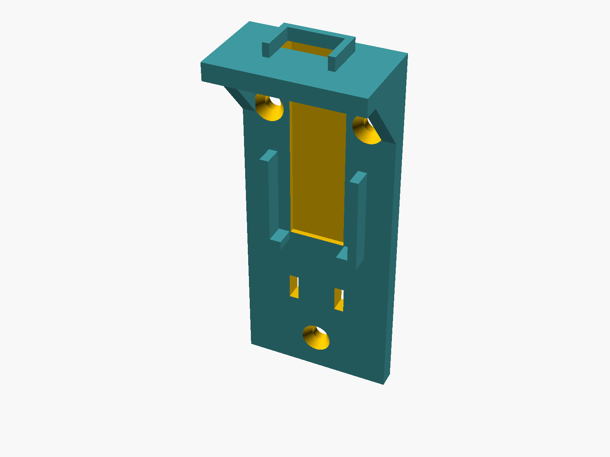
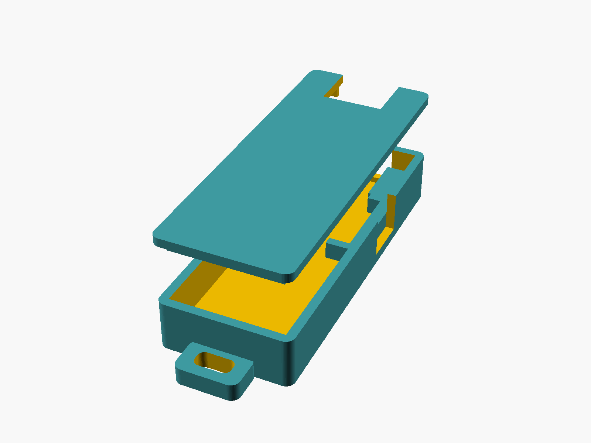

# 3D CAD モデル(アンカー取付具・タグ用ケース)

[docs/hardware.md](../../docs/hardware.md) のハードウェアリストにある「アンカー取付具」「タグ用ケース」の 3D プリント用モデル。OpenSCAD のパラメトリックソースと、書き出し済み STL を置いている。

> **注意**: ボード寸法は公式ストアの公称値(C5: 17.6×19.1×3.4 mm / UWB F: 11.5×12.0×2.8 mm)ベースの **v1 モデルで、実機でのフィット確認は未実施**。印刷後に合わなければ `common.scad` の `tol`(片側クリアランス)や各パラメータを調整すること。

## ファイル

| ファイル | 内容 |
|---|---|
| `common.scad` | ボード公称寸法・公差などの共通パラメータ |
| `anchor_mount.scad` | アンカー取付具(壁面・柱用 L ブラケット) |
| `tag_case.scad` | タグ用ケース(本体 + フタ。`part` で切替) |
| `stl/*.stl` | 書き出し済み STL(`anchor_mount` / `tag_case_body` / `tag_case_lid`) |
| `Makefile` | STL と docs 用プレビュー PNG の再生成 |

## 設計の要点

**アンカー取付具**(`anchor_mount.scad`)



- 垂直プレートを皿ネジ M3×3 本で壁・柱に固定。プレート前面のポケットに C5、上部棚の上面ポケットに UWB F を置く(固定は薄手の両面テープを想定)
- UWB F の**アンテナ端は棚の前縁(壁と反対側)を向き、周囲に樹脂・壁が無い**(基本設計 §3.3 の「金属・壁から離して突き出す」要求に対応)
- FPC はプレート前面の溝 → 棚のスリット経由で両ボードの背面コネクタへ(ボードは部品面が表)
- USB 給電ケーブルは下方へ引き出し、ケーブルタイ用スリットで張力止め

**タグ用ケース**(`tag_case.scad`)



- 内部は長手方向に LiPo | C5 | UWB F の 3 室。仕切りは側方スタブのみで、中央はバッテリー配線と FPC の通り道
- UWB F の**アンテナ端はケース端・フタの開口(アンテナ窓)で樹脂に覆われない**
- C5 の USB-C は側壁スロットから充電・書き込み可能。バッテリー端にストラップループ
- フタはスカートによる摩擦嵌合。LiPo 寸法は `bat` パラメータ(既定 25×36×6.5 mm ≒ 602535 500 mAh)で変更

## 印刷設定の目安

- PLA / PETG、レイヤー 0.2 mm、インフィル 20% 程度
- 向き: 取付具は背面(壁側)をベッドへ、ケース本体は底面、フタは天面をベッドへ → **いずれもサポート不要**

## 再生成

macOS で [OpenSCAD](https://openscad.org/) をインストール(`brew install --cask openscad`)して:

```bash
cd hardware/cad
make          # stl/ と docs/assets/cad-*.png を再生成
# OpenSCAD のパスが違う場合: make OPENSCAD=/path/to/OpenSCAD
```
